# TomorrowEdge

[](https://github.com/axobase001/tomorrowedge/actions/workflows/ci.yml)

**English** | [中文](README.zh-CN.md)

TomorrowEdge is a **local orchestration, governance, and strategy-evolution runtime for heterogeneous Coding Agents**.

It gives engineering teams a local GUI/runtime orchestration layer for governing strong agents, coordinating budget-bounded multi-model execution, convening an Agent Council, assigning TaskGraph ownership, recording traceable evidence, reviewing deliverables, and evolving orchestration policy from objective-action-feedback traces.

It is not another chat bot, single-model CLI wrapper, benchmark dashboard, or general personal-agent OS. TomorrowEdge turns Codex, Claude Code, DeepSeek, MiMo, Ollama, OpenRouter models, local models, command agents, MCP agents, and custom adapters into replaceable capability nodes inside a governed software-engineering council.

```text
Governed orchestration. Full traceability.
Strong agents should decide. Efficient agents should execute.
Codex and Claude Code give agents full access.
TomorrowEdge gives heterogeneous full-access agents governance, trace, budgets, and policy evolution.
```


## Why It Exists

The core problem in AI coding is no longer only model strength. Strong agents can already write code.

The hard part is orchestration and governance:

- Which agent should own the architecture plan?
- When is a strong-agent call worth the cost?
- Which cheaper or local agent can do implementation labor safely?
- Who reviews, judges, and resolves disagreements?
- What evidence is required before patch or shell execution?
- How should the system recover when a delegated task fails?
- How do full-access agents stay visible, auditable, and budget-bounded?

OpenRouter routes requests. TomorrowEdge routes objectives, capabilities, roles, tools, budgets, evidence, task ownership, strategy mutation, and engineering delivery.

## TomorrowEdge 1.6 Canopus

TomorrowEdge 1.6 **Canopus** is **The Convergence Runtime Release**.

Canopus introduces a convergence layer inside the existing orchestration runtime. It does not replace TomorrowEdge's core identity as a heterogeneous Coding Agent orchestration and governance runtime. Instead, it adds a verifiable objective-convergence path: agents no longer finish because they claim completion; a run must satisfy an ObjectiveContract, pass an AcceptanceMatrix, leave evidence, update RunState, and respect a bounded ConvergencePolicy.

Status: Canopus ships a working convergence runtime with mock, noop, shell, and Sirius Council AgentBridge paths. AgentBridge adapters can propose or perform work, but convergence is decided only by structured objective conditions and blocking acceptance checks.

```text
ObjectiveContract + AcceptanceMatrix
        |
        v
ConvergenceEngine
        |
        v
AgentBridge / worker adapter
        |
        v
AcceptanceRunner
        |
        v
RunState / Trace Ledger / Evidence
        |
        v
Next iteration / Stop
```

Canopus adds:

- **ObjectiveContract / CanopusObjective**: structured target definition, success conditions, constraints, and required artifacts. It is not a prompt.
- **AcceptanceMatrix**: blocking and advisory verification checks. Blocking checks have veto power.
- **ConvergencePolicy**: bounded execution policy with max iterations, no-progress detection, repeated-failure detection, and budget abort semantics.
- **RunState / TraceState**: persistent observed state, objective delta, evidence, decision, and timestamps for every loop.
- **ConvergenceEngine**: `observe -> pre-acceptance -> act -> observe -> post-acceptance -> write RunState -> decide next loop`.
- **TraceStateStore / RunLedger**: `.runs/<run_id>/trace.jsonl`, `status.latest.json`, `progress.md`, and per-iteration evidence artifacts.
- **AgentBridge**: mock/noop/shell adapters plus `sirius-council`, which routes action through the Agent Council Governance Runtime while leaving blocking checks authoritative.
- **CLI compatibility alias**: `tedge control init`, `validate`, `run`, `status`, and `report` remain supported as the v1.6 command surface.

Naming map:

| Earlier control-plane term | Canopus public term |
| --- | --- |
| Agent Control Plane | Canopus convergence layer / Canopus Runtime |
| GoalSpec | ObjectiveContract / CanopusObjective |
| EvalSpec | AcceptanceMatrix |
| LoopSpec | ConvergencePolicy |
| StatusSpec | RunState / TraceState |
| ReconciliationController | ConvergenceEngine |
| EvaluationRunner | AcceptanceRunner |
| StatusStore | TraceStateStore / RunLedger |
| DesiredStateDiff | ObjectiveDelta |
| hard gate | blocking check |
| soft gate | advisory check |
| checker_agent | reviewer_role / review_agent |
| actuator | AgentBridge / worker adapter |

Quickstart:

```bash
tedge canopus init --title "Fix bug" --mode coding
tedge canopus validate goal.yaml
tedge canopus run goal.yaml
tedge canopus status
tedge canopus report
```

`tedge control ...` remains supported as a compatibility alias for the same
commands and prints a deprecation warning on stderr. The legacy
`goal/evaluation/loop` schema remains supported for v1.6 compatibility. New
examples use `objective/acceptance/convergence`.

Source-checkout blocking-check runtime demo:

```bash
npm run dev -- canopus validate examples/canopus/simple_bugfix_runtime/objective.yaml
npm run dev -- canopus run examples/canopus/simple_bugfix_runtime/objective.yaml \
  --cwd examples/canopus/simple_bugfix_runtime \
  --adapter shell \
  --action-command "node fix-bug.mjs" \
  --run-id simple_bugfix_runtime
npm run dev -- canopus status --cwd examples/canopus/simple_bugfix_runtime --run-id simple_bugfix_runtime
npm run dev -- canopus report --cwd examples/canopus/simple_bugfix_runtime --run-id simple_bugfix_runtime
```

`examples/canopus/simple_bugfix_runtime` is the public Canopus runtime
acceptance demo: it starts from a failing `npm test`, records pre-action
evidence, lets the shell AgentBridge fix `index.js`, then converges only after the
post-action blocking check passes. `examples/control_plane/*` remains available
as legacy schema compatibility coverage. `examples/control_plane/mock_artifact`
is a deterministic no-test smoke demo, not proof of runtime convergence.

Source-checkout Council-backed AgentBridge demo:

```bash
npm run dev -- canopus run examples/canopus/simple_bugfix_runtime/objective.yaml \
  --cwd examples/canopus/simple_bugfix_runtime \
  --adapter sirius-council \
  --fixture-mode \
  --config examples/configs/sirius-codex-deepseek-mimo.mock.yaml \
  --access-mode full \
  --approve-patch \
  --approve-shell \
  --run-id canopus_sirius_control
```

Read the full design in [Canopus Runtime](docs/canopus_runtime.md).

## Sirius 1.5

**Sirius** is the TomorrowEdge 1.5 release line. Its main runtime is the **Agent Council Governance Runtime**. Canopus keeps Sirius, but adds a convergence layer around unreliable agent execution.

A high-level engineering task enters a Chief Agent first. The Chief Agent can convene Council Members for critique, gap fill, alternative planning, and task claims. The council forms a consensus TaskGraph. Each core task node receives an owner agent, provider, model, and assignment reason. TomorrowEdge then delegates execution while EvidenceGate, BudgetGate, Debate v2, Objective Contract, Strategy Memory, and the event ledger govern the run. Final delivery returns to the Chief Agent for review and judge.

```mermaid
flowchart LR
  User["High-level task"] --> Chief["Chief Agent"]
  Chief --> Council["Agent Council"]
  Council --> Graph["Consensus TaskGraph"]
  Graph --> Own["Task ownership assignment"]
  Own --> Exec["Delegated execution"]
  Exec --> Gates["EvidenceGate + BudgetGate + Debate v2"]
  Gates --> Mutate["Bounded strategy mutation"]
  Mutate --> Final["Chief final review / judge"]
  Final --> Deliver["Deliverable + trace"]
```



Core Sirius modules:

- **Chief Agent Router** sends high-level engineering goals to a chief agent first.
- **AgentCapabilityProfile** makes every model or external agent replaceable by capability, role, trust, cost, latency, and adapter support.
- **Agent Council Planning** records critique, gap fill, alternative planning, task claims, and consensus moves.
- **Task Ownership Assignment** gives every core TaskGraph node an `ownerAgentId`, `assignedProvider`, `assignedModel`, and `assignmentReason`.
- **Delegated Execution Runtime** executes owned nodes while preserving Objective Contract, TaskGraph, RoleGraph, EvidenceGate, BudgetGate, Debate v2, Strategy Memory, and Trace Ledger.
- **Bounded Strategy Mutation** can split tasks, switch owner agents, add reviewers/judges, increase debate, or trigger council replan without mutating safety boundaries.
- **Chief Final Review / Judge** returns the deliverable to the Chief Agent before completion.

Sirius is experimental, but it is now the main product direction.

## Runtime Screenshots

These are actual runtime screenshots captured from the local `tedge client` GUI against a Sirius council fixture session. They are not static design boards.

### Council Cockpit


### Objective Contract And Trace Drawer


### API Key And Provider Setup


### Role Assignment


## What Makes It Different

| Category | Common approach | TomorrowEdge |
| --- | --- | --- |
| Single-agent coding CLI | One strong model owns the whole run | Multiple agents are governed by role, capability, cost, trust, and evidence |
| Model router | Pick a model for one request | Route objectives, roles, tools, context, ownership, verification, and delivery |
| Agent framework | Build agent graphs | Act as a cockpit and governance layer over native workflows and external frameworks |
| Benchmark dashboard | Optimize leaderboard outputs | Treat benchmark and dashboard utilities as secondary evaluation tools |
| Prompt optimization | Tune prompts or fixed workflows | Evolve orchestration policy from objective-action-feedback traces |
| Full-access tools | Give agents broad power | Keep full-access execution visible, logged, budgeted, reviewable, and reversible |

## Quick Start

```bash
npm install
npm run build
npm run client
```

The GUI client opens a local cockpit for natural-language tasks, access-mode selection, provider setup, role routing, approvals, telemetry, details, and trace inspection.

For installed builds:

```bash
tedge client
tedge desktop
```

Run without API keys:

```bash
npm run dev -- run "fix failing test" --headless --fixture-mode --approve-patch --approve-shell
```

Run the Sirius council path:

```bash
npm run dev -- council run "Rewrite a small TypeScript utility as a Rust module with tests" --headless --fixture-mode
npm run dev -- council run \
  --headless \
  --fixture-mode \
  --config examples/configs/sirius-codex-deepseek-mimo.mock.yaml \
  --cwd examples/agent-council-rust-rewrite \
  "rebuild this JS CLI app in Rust"
```

Headless Sirius runs print `configSource` and `configPath`. The packaged mock
config is intentionally reproducible from outside the repo root and records
`chief_agent` / `agent` sources when the mock command agents are actually
invoked.

Installed-package equivalent:

```bash
tedge council run \
  --headless \
  --fixture-mode \
  --config node_modules/@axobase001/tomorrowedge/examples/configs/sirius-codex-deepseek-mimo.mock.yaml \
  --cwd node_modules/@axobase001/tomorrowedge/examples/agent-council-rust-rewrite \
  "rebuild this JS CLI app in Rust"
```

The Sirius mock config demonstrates agent-backed command adapters. Native
deterministic council remains the fixture/fallback path, and real
Codex/DeepSeek/MiMo usage requires provider keys, command runners, or MCP
access configured for your own agents.

Or through the normal `run` command:

```bash
tedge run "rewrite this service with a safer architecture" --agent-council
```

## Configure Providers

Open the GUI and click **Keys** to configure providers and role routing. TomorrowEdge stores local secrets through the encrypted local secret store or environment-variable indirection; config files keep env-var references instead of raw keys.

Recommended first setup:

1. Start with OpenRouter if you are not sure. One key gives access to many model families.
2. Use separate provider keys when possible for rate-limit isolation, cost tracing, and failure diagnosis.
3. Assign stronger agents to chief/planner/reviewer/judge roles.
4. Assign cheaper or local agents to explorer/coder/test/documentation roles where risk allows.
5. Keep `auto` when you want TomorrowEdge to choose by routing policy.

Provider runtime controls are separate from workflow limits:

- `providers.<id>.requestTimeoutMs` controls one HTTP/model request timeout.
- `providers.<id>.maxRetries` controls provider-level retry attempts.
- `autonomy.max_iterations` and repair/debate limits control workflow loops, not HTTP request timeouts.

Example role intent:

```yaml
chief_agent:
  prefer: [strong_reasoning, external_codex, external_claude]

role_routing:
  planner:
    prefer: [strong_reasoning]
  coder_a:
    prefer: [coding, fast]
  coder_b:
    prefer: [cheap, coding]
  reviewer:
    prefer: [strong_reasoning, conservative]
  judge:
    prefer: [strong_reasoning]
```

The model names in screenshots are examples, not hardcoded product requirements.

## Core Concepts

### Objective Contract

TomorrowEdge inserts a verifiable contract before planning. It defines success criteria, failure criteria, allowed tools, forbidden actions, required evidence, budget bounds, role permissions, and stop conditions. Planner output can add operational detail, but it cannot relax the contract.

### Agent Council

The Chief Agent can convene a council of replaceable agents. Council members produce structured moves:

- critique
- gap fill
- alternative plan
- task claim
- consensus revision
- final consensus

### Task Ownership

TaskGraph nodes are not abstract labels only. Core nodes carry concrete ownership:

- `ownerAgentId`
- `assignedProvider`
- `assignedModel`
- `assignmentReason`
- fallback candidates
- evidence refs
- artifact refs

### Evidence And Trace

Runtime artifacts are preserved for replay, while compact evidence packets are projected to models. Every important action writes to the event ledger: route decisions, budget decisions, model calls, council moves, task results, reviews, judge decisions, patch actions, shell runs, repairs, mutations, and final summaries.

### Orchestration Policy Genome

Inspired by evolutionary algorithms, TomorrowEdge makes orchestration policy the unit of evolution. The unit of evolution is not answer, prompt, or agent; it is orchestration policy.

The system does not evolve model weights, raw prompts, or individual answers. It evolves bounded runtime policies that decide how contracts are generated, how plans are derived, how roles are routed, how evidence is verified, how failures are repaired, how traces are retrieved, and when a run should stop or ask the user.

> The unit of evolution is not the answer, the prompt, or the agent. It is the orchestration policy.

Safety boundaries cannot be mutated.

## Access Modes

| Mode | Behavior |
| --- | --- |
| `restricted` | No patch or shell execution. Read-only and advisory workflows only. |
| `partial` | Patch and shell actions require approval. |
| `full` | Patch, shell, and repair can run automatically when policy permits. Every step is still logged. |

Full access means governed autonomy plus full traceability, not silent execution.

## CLI Map

```bash
tedge client                         # local GUI client
tedge desktop                        # optional local desktop window
tedge run "fix failing test"          # native workflow
tedge run "..." --agent-council       # Sirius council path
tedge council run "..."               # explicit council runtime
tedge models --connection-test        # provider connectivity checks
tedge trace latest --verbose          # inspect latest event ledger
tedge sessions inspect latest         # structured session inspector
tedge policy inspect                  # policy genome
tedge policy evolve --offline         # offline policy evolution
tedge skills list                     # governed skills and tool packs
tedge mcp serve                       # MCP bridge for external agents
```

Useful development checks:

```bash
npm run build
npm run web:build
npm run docs:status
npm run secrets:scan
npm run test:council
```

## External Agents

TomorrowEdge does not replace Codex, Claude Code, or other coding agents. It can bind them into workflow roles through MCP or command adapters.

Examples:

- Codex as Chief Agent, planner, reviewer, or judge.
- Claude Code as architecture reviewer or final judge.
- DeepSeek / Kimi / Qwen / MiMo as implementation, exploration, or test-planning agents.
- Ollama or local agents for privacy-sensitive roles.

External agents should submit typed role outputs instead of opaque final answers.

## Capability Stitching

TomorrowEdge routes capabilities, not just requests.

Example:

```text
Screenshot / diagram / error image
  -> Vision Agent
  -> Structured Visual Spec
  -> Planner / Coder
  -> Patch / Test
  -> Reviewer / Judge
```

A model that sees images does not need to be the model that writes code. A model that writes fast does not need to be the model that judges risk.

## Documentation

- [Agent Council Governance Runtime](docs/AGENT_COUNCIL_GOVERNANCE.md)
- [Agent Capability Profiles](docs/AGENT_CAPABILITY_PROFILES.md)
- [Chief Agent Runtime](docs/CHIEF_AGENT_RUNTIME.md)
- [Delegated Execution Runtime](docs/DELEGATED_EXECUTION_RUNTIME.md)
- [Policy Evolution Runtime](docs/POLICY_EVOLUTION_RUNTIME.md)
- [Objective Contracts](docs/OBJECTIVE_CONTRACTS.md)
- [Trace Memory](docs/TRACE_MEMORY.md)
- [Adaptive Orchestration Runtime](docs/ADAPTIVE_ORCHESTRATION.md)
- [MCP Agent Bridge](docs/MCP_AGENT_BRIDGE.md)
- [Local Cockpit API](docs/LOCAL_COCKPIT_API.md)
- [Capability Status](docs/CAPABILITY_STATUS.md)
- [README Promise Map](docs/README_PROMISE_MAP.md)

## Current Status

Current version: `1.6.2`.

Release line: Canopus.

Implemented mainline pieces include:

- GUI client and optional desktop shell.
- Provider onboarding and connection tests.
- Role routing and configurable role assignment.
- Objective Contract.
- Agent Council Governance Runtime.
- Task ownership assignment.
- Delegated execution events.
- Evidence packets and artifact-aware trace export.
- Budget governance and real/simulated strong-agent telemetry.
- Debate v2, reviewer, judge, repair, and bounded mutation events.
- MCP bridge and command external-agent runner skeleton.
- Offline fixture workflows and deterministic council demo path.

Some parts remain experimental:

- Deep external Codex / Claude Code process integration.
- Fully asynchronous graph runtime.
- Long-horizon policy evolution quality.
- Public comparative evaluation.

## Privacy And Safety

TomorrowEdge is local-first. Sessions, artifacts, traces, and local secrets stay in the local workspace unless you explicitly configure external providers or publish artifacts.

Never commit real API keys. Use environment variables or the local encrypted secret store. The release secret scanner excludes generated artifacts and binary screenshots, but provider keys should still be rotated if they were ever pasted into chat, screenshots, or public logs.

## License

MIT
