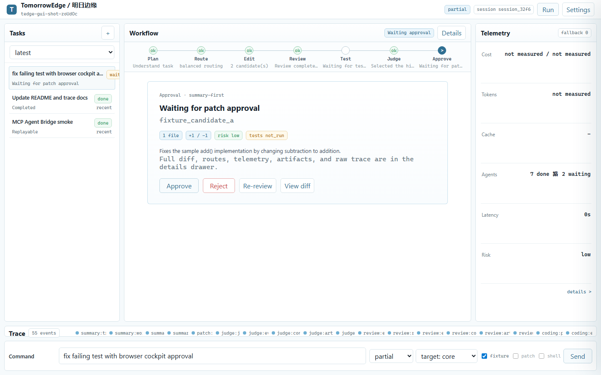
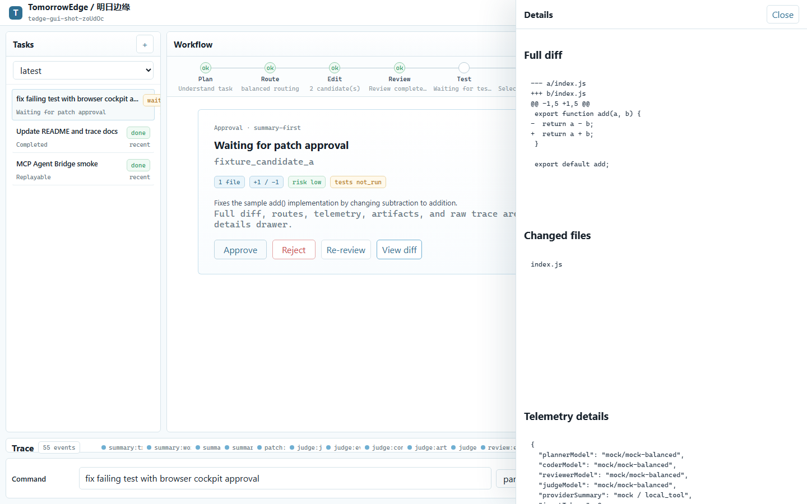
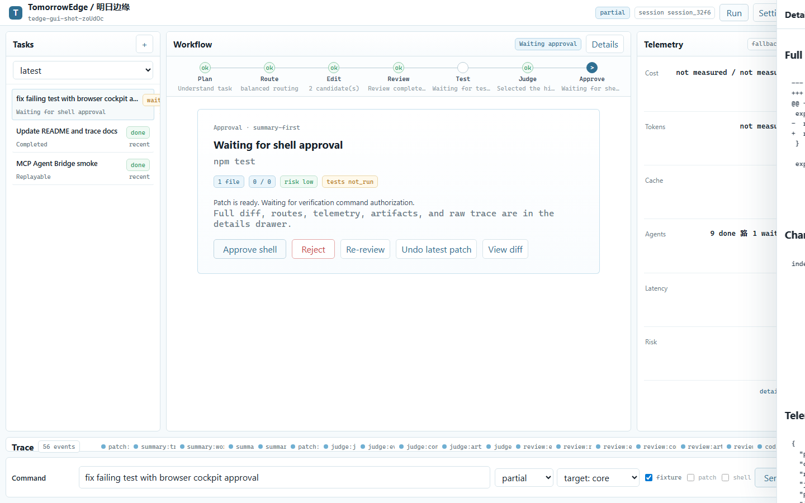
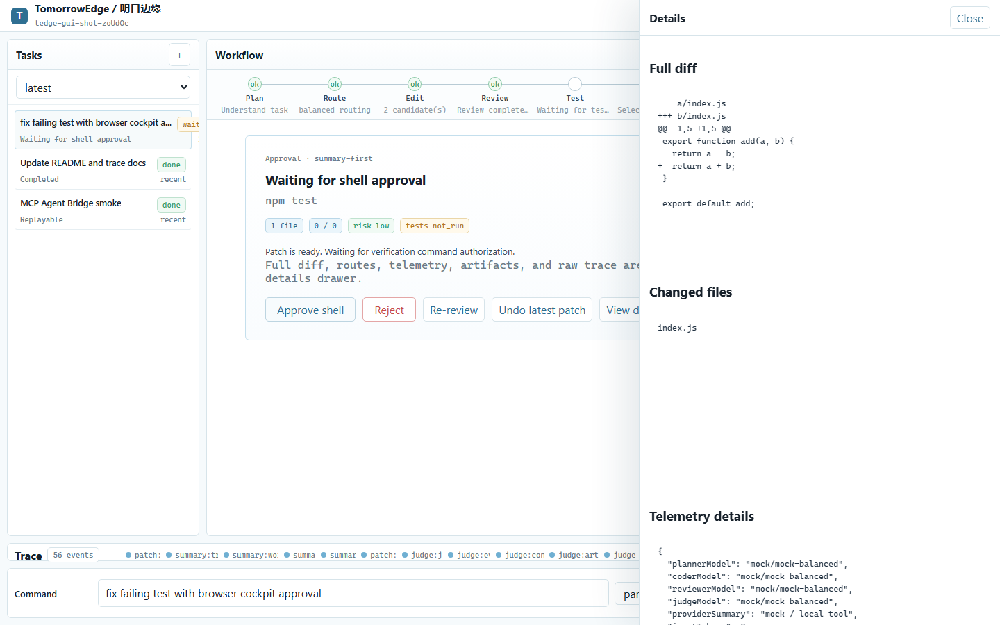
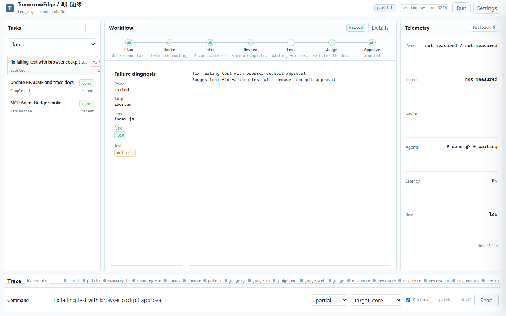

# TomorrowEdge / 明日边缘

[](https://github.com/axobase001/tomorrowedge/actions/workflows/ci.yml)

**中文** | [English](#english)

明日边缘是一个 **面向用户场景的自迭代 Agent 编排层 GUI/runtime**：它以 **多模型强治理** 和 **多 Agent 工作流编排** 为核心，通过 **Objective Contract、objective-action-feedback trace 与 Orchestration Policy Genome** 把编排策略本身变成可审计、可评分、可离线改进的运行时对象。

它位于模型 API、外部 coding agents 与真实代码仓库之间，不负责替某一个模型赢，而是把强模型、高性价比模型、本地模型、外部 agents、人类授权、目标契约、证据验证和执行反馈组织成一个可监督、可审计、可回滚、可迭代的软件工程工作流。

```text
Full autonomy, full visibility.
完全自治，完全可见。
```

当前 AI Coding 的核心问题不是模型不够强，而是编排不够好。强模型已经能写代码，但真实工程任务仍然会卡在上下文选择、角色分工、预算约束、风险审查、失败修复、证据留存和人类授权上。单模型 full-access agent 可以很猛，但也容易变成黑盒：它为什么改这个文件、为什么跑这个命令、为什么信这个 patch、为什么花掉这次强模型调用，用户往往看不清。

TomorrowEdge 的目标是做这个中间编排层：**强模型负责高价值判断，高性价比模型负责大规模执行，本地模型保护隐私，人类授权关键动作。**

Full 模式是完整工作区工具权限下的自治执行。TomorrowEdge 会自动应用 patch、运行 shell、执行 repair loop，并继续迭代，不会每一步都打断用户确认。

它与黑盒 full-access agent 的区别不是限制权限，而是治理和可见性：每次模型调用、上下文选择、路由理由、patch、命令、review、judge 裁决、fallback、成本更新和验证结果都会显示在 GUI client 中，并写入可回放事件账本。

## 为什么存在

明日边缘存在的原因，是 AI coding 的未来不会是单模型的。

不同模型有不同的能力、价格、上下文长度、延迟与隐私边界。模型厂有动力把用户留在自家模型栈里，但工程团队真正需要的是跨模型的最优组合：用强模型做架构判断、审查和裁决，用高性价比模型做探索、实现和重复劳动，用本地模型守住隐私，用外部 coding agents 承担关键角色，用人类授权真正重要的动作。

TomorrowEdge 关注的不是“接入更多模型”本身，而是 **预算约束下的异构模型系统效率**：哪些步骤值得调用强模型，哪些步骤应该交给便宜模型，什么时候需要外部 agent，什么时候需要本地模型，什么时候必须让人类确认。它把这些选择变成可解释、可追踪、可复盘的工作流。

OpenRouter 解决“怎么调用多个模型”；TomorrowEdge 解决“怎么让多个模型和多个 agents 在一个真实工程任务里分工、争辩、监督、交付”。

## Self-Iterating Agent Orchestration Layer

TomorrowEdge 1.3 introduces a **contract-first, trace-shaped, evolution-inspired orchestration layer**.

Most agents jump directly from user instruction to planning and tool calls. TomorrowEdge inserts a verifiable **Objective Contract** before planning. The contract defines:

- what the local objective is;
- what success and failure mean;
- what evidence is required;
- which tools, roles, and actions are allowed;
- which actions are forbidden;
- what budget and risk bounds apply;
- when the system should continue, repair, downgrade, ask the user, or stop.

Planner output can add operational detail, but it cannot relax the contract.

After each run, TomorrowEdge writes an **objective-action-feedback trace**: a compact learning record over the full event ledger, including the objective contract, plan, role graph, tool calls, observations, evidence packets, verification result, repair outcome, cost, failure type, and user feedback signals. Future runs can retrieve similar traces and reuse lessons without sending full logs, diffs, or shell output back to a model.

### Core innovation: Orchestration Policy Genome

Inspired by evolutionary algorithms, **TomorrowEdge makes orchestration policy the unit of evolution.**

The system does not evolve model weights, raw prompts, or individual answers. It evolves bounded runtime policies that decide:

- how objective contracts are generated;
- how plans are derived;
- how models, roles, tools, and external agents are routed;
- how evidence is verified;
- how failures are repaired;
- how traces are retrieved;
- when a run should stop, downgrade, or ask the user.

Each policy genome can be scored against objective-action-feedback traces. Successful, evidence-complete, low-risk, cost-efficient runs increase policy fitness; risky, incomplete, unstable, or expensive runs reduce it. Policy evolution is deliberately offline and bounded: it mutates only safe orchestration knobs, never the safety boundary itself.

In plain terms: the unit of evolution is not answer, prompt, or agent; it is orchestration policy.

> The unit of evolution is not the answer, the prompt, or the agent. It is the orchestration policy.
>
> This is not just memory. It is experience-shaped orchestration.

```bash
tedge contract inspect latest
tedge trace inspect latest
tedge trace list --scenario debugging --limit 20
tedge policy inspect
tedge policy evolve --offline --generations 2 --population 4 --elite 2
tedge policy eval
tedge skills list
tedge skills propose --min-support 2 --write
```

Docs:

- [Objective Contracts](docs/OBJECTIVE_CONTRACTS.md)
- [Trace Memory](docs/TRACE_MEMORY.md)
- [Self-Iterating Orchestration](docs/SELF_ITERATING_ORCHESTRATION.md)
- [Policy Evolution](docs/POLICY_EVOLUTION.md)
- [Governed Skills And Tool Packs](docs/SKILLS_AND_TOOL_PACKS.md)

## 差异化

| 对比对象 | 它们通常解决什么 | TomorrowEdge 解决什么 |
| --- | --- | --- |
| 单模型 coding CLI | 让一个模型直接读写代码 | 把任务拆成 planner / coder / reviewer / judge / repairer 等角色，并为每个角色选择合适模型 |
| Codex / Claude Code | 给强 agent 完整工具权限 | 治理强 agent 的调用位置、预算、证据、审查和最终交付 |
| OpenRouter | 路由模型请求 | 路由角色、能力、预算和工程工作流 |
| LangGraph / CrewAI / AutoGen | 构建 agent framework | 把 native workflow 和现有 agent framework 纳入同一个可视化 cockpit |
| Prompt / workflow optimization tools | 优化 prompt、固定 workflow 或 benchmark 分数 | 把 **编排策略本身** 作为进化单位：目标契约生成、规划、路由、验证、修复、停止和 trace 检索都可被审计、评分和离线改进 |
| 普通 GUI wrapper | 显示聊天和输出 | 显示路由理由、成本、风险、diff、测试、fallback、审批、trace 和 artifact |

一句话：**OpenRouter 路由请求；TomorrowEdge 路由目标、能力、角色、工具、预算、证据和工程交付。**

In one line: **OpenRouter routes requests. TomorrowEdge routes objectives, capabilities, roles, tools, budgets, evidence, and engineering delivery.**

## 当前版本

当前版本：`1.3.5`。

- `1.3.5` clears a GUI/runtime governance sweep: empty GUI top-bar runs are rejected, Telemetry details opens the drawer, no-auth local providers remain assignable, Re-review clears stale patch approvals, TUI shell approval honors `shell.policy`, external agent `allowedRoles` and restricted-mode core gates are enforced, planner/governance model calls pass through budget preflight, and direct provider `model_call` usage is included in cost/token telemetry.
- `1.3.4` adds the governed skills and human-seeded tool-pack foundation: skill manifests, built-in workflow/workspace/code/GitHub/web/document/data/API packs, lifecycle/validation gates, inert candidate proposals from traces, tool/skill routing policy, structured objective-trace tool usage, and `tedge skills` commands.
- `1.3.3` closes the next self-iteration audit gap: selected draft PR work expands policy genome mutation/routing coverage; objective traces now preserve bounded policy attribution and trace completeness; scenario-scoped runtime selection falls back to global evolved policies; trace retrieval records real rejected candidates instead of hardcoded zero.
- `1.3.2` polishes the 1.3 runtime release: README now has one top-level definition and the self-iterating orchestration section appears before differentiation; `planningPolicy.allowParallelRoles=false` disables optional parallel candidate/debate branches; trace retrieval now applies `tracePolicy` recency, success/failure, stale, same-scenario, and same-workflow weighting.
- `1.3.1` integrates the Orchestration Policy Genome into the runtime path: policy fields now affect contract depth, plan-step evidence binding, role routing, verification strictness, repair limits, stop decisions, and contract tool/action gates.
- `1.3.0` introduces the contract-first self-iterating orchestration layer: Objective Contracts before planning, objective-action-feedback trace memory after runs, trace-guided policy scoring, offline policy evolution, and GUI/CLI inspection surfaces for contract, trace, and policy state.
- `1.2.15` releases the failure-memory/error-loop upgrade: retrieval policy now supports balanced exploit, forced exploit, forced exploration, and deterministic random control; failure lessons store scoped correction rules and verification status; error-loop experiments export falsifiable hypothesis metrics; and ablation runs can compare memory-off, write-only, retrieve-only, success-only, failure-only, and random-control modes.
- `1.2.14` clears the P0-P2 issue sweep: OpenRouter display labels now canonicalize to real model IDs, model discovery now refreshes common non-OpenRouter providers, provider tests smoke-test the selected model, verbose trace output compresses huge context exclusions, GUI final/failure panels show user-facing results and diagnosis, artifact refs are clickable, saved sessions can be renamed/deleted, live agent status updates telemetry, pre-judge reviewer/judge model advice feeds debate evidence, workflow simulation now runs through the NativeBackend dry-run path, local cockpit URLs no longer expose nonce tokens in the address bar, strong-agent role budgets now also debit the global strong-agent pool, parallel candidate state is normalized before review, document-only deliverables avoid irrelevant repository test runs, and capability docs clarify env/local-env API key storage versus planned keychain/encrypted storage.
- `1.2.13` clears the next GUI orchestration issue batch: the composer can choose target roles and run mode (`auto` / `fixture` / `offline` / `live`), clears submitted commands after acceptance, GUI runs now use the orchestration backend registry plus CLI project preferences and strategy memory, fixture demos run in isolated sample workspaces, live patch/advisory calls emit invocation-time `budget_decision` events, Chinese file-creation tasks no longer collapse into read-only workflows, pending patch authorization is no longer shown as rejected history, patch failures leave waiting approval with a clear failure state, nested project-relative add-file paths are accepted, obvious mojibake/malformed HTML additions are blocked, the detail drawer shows the RoleGraph, configured no-auth local providers and external MCP agents no longer force fixture fallback, the key manager supports model-only provider saves and OpenRouter/free-model refresh, and custom OpenAI-compatible gateways can be added from the GUI.
- `1.2.12` closes the high-priority orchestration and GUI trace issue batch: coder candidates and live patch generation now start in the same candidate-production stage, external MCP processes are reused during role calls, planner/explorer results can be cached, built-in workflow recipes are available, judge decisions consume debate evidence, repair approvals stay visible, and route drawers show routing reasons.
- `1.2.11` hardens the native runtime governance loop: routing now emits budget previews without consuming budget, live/external role calls pass through an execution BudgetGate, blocked roles fall back or stop without blocked+success contradictions, read-only trace completeness uses a read-only rubric, and role graph foundations describe workflow-kind-aware orchestration.
- `1.2.10` upgrades planner/routing/budget governance: planning can use a structured model-backed planner with native fallback, native plans are adaptive instead of fixed four-step templates, routes can update after planning, and per-role budget caps are now configurable.
- `1.2.9` extends compatible API setup: GUI first-run setup and the `Keys` panel can save provider base URLs, and MiMo/OpenAI-compatible defaults no longer start blank.
- `1.2.8` fixes DeepSeek GUI key-manager onboarding by supplying the known default endpoint and migrating older blank `base_url` configs at load time.
- `1.2.7` adds GUI language switching. The local client defaults to English and can switch to Chinese from the top bar, with the preference saved locally.
- `1.2.6` adds a GUI `Keys` panel for simple provider API-key setup and per-role model assignment while keeping raw keys out of config.
- `1.2.5` tightens GUI E2E coverage for telemetry routing, drawer open/close, and patch/shell approval completion.
- `1.2.4` clears the latest community GUI/config issue batch: no-op approvals, stale session selectors, setup defaults, read-only path detection, and MCP-aware provider reference validation.
- `1.2.3` fixes GUI tasks that are semantically read-only but were incorrectly sent through the patch approval workflow.
- `1.2.2` hardens GUI/live-model defaults and release packaging after the latest community PR sweep.
- `1.2.1` fixes local dev startup so `client`, `desktop`, and `serve` build React cockpit assets before launching, avoiding stale embedded fallback UI on fresh checkouts.
- `1.2.0` GUI client adds first-run provider/model setup, local env-key storage, provider connection testing, and a composer-side access-mode dropdown for `restricted` / `partial` / `full`.
- `1.1.10` GUI CSS now supports OS dark mode in the React and fallback HTML cockpits, and the fallback HTML cockpit no longer hard-locks 1080px/980px minimum widths.
- `1.1.9` GUI detail drawer now includes a capability dashboard backed by a product registry for workflow ledger, provider routing, evidence/budget/cost telemetry, MCP external agents, orchestration adapters, and GUI readiness.
- `1.1.8` GUI detail drawer now includes an approval-history timeline with approvalId, actor/source, blocked-progress reason, diff/output refs, undo snapshots, and patch/shell/pending/completed filter tags.
- `1.1.7` GUI session source badges now distinguish live session, saved snapshot, fixture demo, and API unavailable states, with connection, fixture, and stale snapshot markers.
- `1.1.6` 新增正式 GUI cockpit E2E smoke：CI 会启动编译后的 `tedge client --no-open --port 0`，用 Playwright 打开本地 cockpit URL，提交 fixture 任务，等待 approval，打开 drawer，并检查 1440/1180/768/390px 无横向溢出；失败时上传截图、trace 和脱敏 server log。

- `1.1.5` 是 GitHub issue 队列加固版：合并 local cockpit API 安全校验、React GUI client 接入、desktop launcher 生命周期测试、package zip/pack smoke、README promise map，并补上 CLI contract 测试与 benchmark demo 警告。

- `1.1.4` 修正 GUI/desktop 品牌标识：客户端顶部栏、favicon 和 web manifest 现在使用 TomorrowEdge 几何 mark，不再退回浏览器默认图标。

- `1.1.3` 修复 GUI command composer 的严重交互问题：Enter 现在发送自然语言指令，Shift+Enter 保留换行，并保护中文/日文/韩文输入法 composition，不会在组词中误发送。
- `1.1.2` 新增可选本地桌面 app 启动方式：`tedge desktop` / `npm run desktop` 会复用同一套 nonce-protected local cockpit，在独立桌面窗口中打开 TomorrowEdge。默认不强制安装 Electron；需要 Electron 壳时可使用 `--runtime electron`。
- `1.1.1` 把主入口收口为 **TomorrowEdge GUI Client**：新增 `tedge client` / `npm run client`，README 隐藏 TUI 截图介绍和 UI style 说明，让用户第一次启动时只看到一个清晰客户端入口。
- `1.1.0` 引入 **TomorrowEdge GUI Client**：简化顶栏、轻量任务队列、中心 workflow 主区、右侧 collapsed telemetry summary，以及底部自然语言 command composer。GUI 是默认操作者入口，而不是后台管理系统。
- `1.0.1` 是 1.0 后的稳定性修复版本：修正 live provider agent kind 标记，补上真实 Ink raw-mode 键盘 smoke 测试，并清理/关闭当前远端 issue 与过期 PR。
- `1.0.0` 的重点是 **Architecture Upgrade Phase 1**：引入 context projection、evidence packet、role-routing diagnostics、strong-agent budget scaffolding 和 typed external-agent handoff contracts。

- TomorrowEdge preserves full artifacts for replay, but projects compact evidence packets to models.
- Reviewer/Judge 可以消费结构化 evidence packets，而不是只看 raw diff/log。
- `tedge trace latest --diagnostics` 和 `tedge diagnostics latest` 会显示 routing、fallback、projection、budget、repair、trace completeness。
- 外部 agent handoff 新增 typed task/result envelopes，为真实 Codex/Claude Code role binding 打基础。

Capability maturity: see [Capability Status](docs/CAPABILITY_STATUS.md) for the
authoritative stable / experimental / placeholder / planned table.
README GUI, desktop, and release-package promises are tracked in
[README Promise Map](docs/README_PROMISE_MAP.md).

## 3-minute tryout

```bash
git clone https://github.com/axobase001/tomorrowedge
cd tomorrowedge
npm ci
npm run verify
npm run dev -- recipes
npm run dev -- run --recipe bugfix-sprint --headless --fixture-mode --approve-patch --approve-shell
npm run dev -- run "fix failing test" --headless --fixture-mode --approve-patch --approve-shell
npm run dev -- trace latest --verbose
npm run client
# optional standalone desktop window
npm run desktop
```

No API key required. This runs the offline fixture workflow, applies a safe
fixture patch, runs verification, and shows the replayable event ledger.

## GUI Client Runtime Screenshots

These screenshots are captured from the local browser cockpit opened by
`tedge client` against a fixture session. They are runtime screenshots,
not image2 reference boards.

**Approval-first main workspace**



**Details drawer fully open**



**Approval action applied**



**Live running state**


**Telemetry expanded**



**Muted failure diagnosis**



## 快速开始

```bash
node --version   # requires Node >=20.19.0
npm install
npm test
npm run dev -- doctor
npm run verify
npm run dev -- init
npm run dev -- init --force
npm run dev -- run "fix failing test" --headless
npm run dev -- run "fix failing test" --headless --fixture-mode --approve-patch --approve-shell
npm run client
```

`npm run client` 会打开 TomorrowEdge GUI Client。安装后的 CLI 可使用 `tedge client`；只想打印本地地址时使用 `tedge client --no-open`。
`tedge client` 默认服务构建后的 React cockpit；仅在缺少 `dist/cockpit-web` 时回退到内置 HTML fallback。

可选桌面窗口：

```bash
npm run desktop
tedge desktop
tedge desktop --runtime app-mode
tedge desktop --runtime electron
```

`desktop` 仍然只绑定本机 `127.0.0.1`，并复用同一套事件账本、审批动作和 GUI view model。默认 `auto` 会优先使用可选 Electron；未安装 Electron 时使用系统 Chromium/Edge 的 app-window 模式；再不行才退回普通本地浏览器窗口。
只有需要 Electron 壳时才安装：`npm install --save-dev electron`。

深度演示与排障：

- [端到端工作流案例：fixture repair loop](docs/WORKFLOW_CASE_STUDY.md)
- [Provider / MCP / full mode troubleshooting](docs/TROUBLESHOOTING.md)

默认测试和演示都可以离线运行，不需要 API key。云端 provider 只有在显式配置环境变量后才会启用；启用后 `tedge run` 会优先尝试非破坏性 live 候选，必要时仍可用 `--offline` 回到纯离线 fixture/mock 路径。
`npm run dev` 在 WSL 且临时目录落到 Windows mount 时会自动把 `TMPDIR` 切到 `/tmp`，避免 `tsx` IPC socket 失败。

## 核心能力

- 目标契约优先：每次 run 在 planning / editing 前生成 Objective Contract，明确 local objective、success criteria、required evidence、allowed tools、forbidden actions、budget bounds 和 stop conditions
- 自迭代编排层：每次执行都会写入 objective-action-feedback trace，让后续任务可以复用相似场景下的成功经验、失败教训和验证策略
- 编排策略基因组：将 contract generation、planning、routing、verification、repair、stop 和 trace retrieval 抽象为可评分、可选择、可离线变异的 Orchestration Policy Genome
- 进化算法启发的离线改进：不修改模型权重，不放宽安全边界，只在可审计的 orchestration policy 层基于 trace fitness 做离线评估和改进
- 强模型治理：把昂贵/强推理 agent 保留给 planner、reviewer、judge、失败升级和安全敏感变更
- 预算约束路由：按角色、风险、能力、上下文长度、延迟、隐私和成本选择模型，而不是盲目调用最贵模型
- 多 Agent 工作流编排：Planner、Explorer、Coder-A/B、Reviewer、Judge、Runner、Repairer、Summarizer 等角色协同完成工程任务
- 异构模型系统效率：OpenRouter、DeepSeek、MiMo、Kimi、Anthropic、Gemini、Ollama、本地 mock/fixture、OpenAI-compatible 等可以在同一任务里分工
- 能力拼接式路由：图片/截图/流程图先交给 Vision Agent，再把结构化规格交给 coding agent
- MCP Agent Bridge：把 Claude Code / Codex 等外部 coding agents 绑定为 core/planner/reviewer/judge/coder/repairer，而不是替代它们
- 可解释路由：记录 role -> model / external agent 的选择理由、fallback 原因、预算决策和风险信号
- 证据化交付：reviewer/judge 消费 patch、测试、stdout/stderr、artifact refs 和 evidence packets，而不是只看一段模型回答
- Full-access trace：每次模型调用、上下文选择、patch、shell、review、judge、repair 和 summary 都进入事件账本
- 访问模式：`restricted`、`partial`、`full`
- GUI control plane：任务队列、workflow 主焦点、审批动作、telemetry、details drawer、trace strip、Key/Role 管理和自然语言 command composer
- 可选桌面 app 窗口：`tedge desktop` 复用本地 GUI client，不复制运行时核心
- 共享 cockpit ViewModel/API：让 GUI client、desktop shell、local cockpit API 和后续客户端复用同一运行态

## 常用命令

```bash
tedge init
tedge client
tedge client --no-open
tedge desktop
tedge desktop --runtime app-mode
tedge desktop --runtime electron
tedge targets
tedge ask --to reviewer "is this patch safe?"
tedge run "task"
tedge run --to debate "task"
tedge run "task" --headless
tedge run "task" --live
tedge run "task" --offline
tedge config
tedge models
tedge models --refresh-free
tedge models --configure-free moonshotai/kimi-k2.6:free --free-first
tedge models --connection-test
tedge models --real-smoke
tedge models --smoke-suite
tedge mode restricted
tedge mode partial
tedge mode full
tedge prefs
tedge drill "task"
tedge workflow "task"
tedge mcp serve
tedge mcp tools
tedge mcp agents
tedge mcp agents --diagnose
tedge replay latest
tedge trace latest
tedge trace latest --verbose
tedge trace inspect latest
tedge trace list --scenario debugging
tedge contract inspect latest
tedge policy inspect
tedge policy evolve --offline
tedge policy eval
tedge skills packs
tedge skills list
tedge skills propose --min-support 2 --write
tedge skills validate path/to/skill.json
tedge export latest --format markdown
tedge export latest --brief
tedge export latest --format json --include-artifacts
tedge sessions
tedge memory
tedge memory failures
tedge memory show <failure-id>
tedge memory explain "fix npm test failure in index.js"
tedge experiment error-loop --ablation memory_on,memory_off
tedge review-export latest --format github
tedge github-report latest --repo owner/repo --pr 123 --dry-run
tedge github-report latest --repo owner/repo --pr 123 --post-comment
tedge github-report latest --repo owner/repo --pr 123 --post-check
tedge undo --list
tedge undo
```

`--post-check` 会通过 `gh api` 创建 GitHub Checks API check run；目标仓库的 token
需要允许创建 check run。

GUI command composer 是自然语言任务和审批反馈的主入口。CLI 命令仍可用于脚本化运行、配置和自动化。

## 权限模式

```bash
tedge mode restricted
tedge mode partial
tedge mode full
tedge run "task" --access-mode restricted
```

- `restricted`：禁止云模型调用和本地变更
- `partial`：允许模型调用，但 patch/shell/repair 需要授权
- `full`：自治执行；自动应用 patch、运行 shell、执行 repair loop，并把每一步写入事件账本

`full` 会自动批准 patch/shell/repair。CLI 会在进入 full autonomy 时输出风险提示；建议先在 clean repo、sandbox 或 fixture 中使用。

Shell execution is governed by `shell.policy`:

- `unrestricted`: Codex-style executable invocation with arbitrary executable
  plus args, executed with `shell: false`; shell metacharacters such as `&&`,
  pipes, and redirects are still blocked.
- `verification_allowlist`: only common verification commands such as `npm`,
  `node`, `pytest`, `cargo`, `make`, `cmake`, `go`, `uv`, `bun`, and `deno`.
- `approval_required`: user confirmation is required before shell execution.

## Fixture 演示

完整 approved patch/test loop：

```bash
tedge run "fix failing test" --headless --fixture-mode --approve-patch --approve-shell
```

失败测试后的 Repairer loop：

```bash
tedge run "fix failing test" --headless --fixture-mode --approve-patch --approve-shell --fixture-failing-patch --repair-on-fail --approve-repair
```

没有 `--approve-patch` 不会应用 diff；没有 `--approve-shell` 不会运行测试；没有 `--approve-repair` 只会记录 repair candidate。
从 TomorrowEdge 项目根目录运行 fixture demo 时，CLI 会复制 `tests/fixtures/sample-repo-basic` 到临时目录执行；headless 输出中的 `fixtureWorkspace` 会显示实际执行目录。

## 多模型工作流

非破坏性能力 drill：

```bash
tedge drill "fix the failing add test" --fixture sample-repo-basic --providers openrouter,deepseek,mimo
tedge drill "restore the login screen from the screenshot" --fixture sample-repo-react-ui --providers openrouter,deepseek,mimo
```

完整 Core-led workflow：

```bash
tedge workflow "design and land a real multi-model orchestration workflow" --providers openrouter,deepseek,mimo
tedge workflow "design and land a real multi-model orchestration workflow" --providers openrouter,deepseek,mimo --rounds 2
```

`workflow` 支持 1-5 轮辩论。第 1 轮是角色发言，后续轮次是交叉质询：模型会围绕上轮 transcript 里的矛盾、授权边界和落地风险互相挑战。每个 live batch 都会按 `debate.max_cost_usd` 做预算预检。

## MCP Agent Bridge

TomorrowEdge 不替代 Claude Code / Codex，而是把它们纳入 full-access multi-model cockpit。Codex / Claude Code gives agents full access. TomorrowEdge gives full access a cockpit.
TomorrowEdge 不替代你已经订阅的 Claude Code / Codex，而是把它们变成可编排、可观测的角色节点。

MCP bridge 允许外部 coding agents 承担 `core`、`planner`、`reviewer`、`judge`、`coder_a`、`repairer` 等角色。TomorrowEdge 继续负责 orchestration、routing、trace、event ledger、session export 和 cockpit 可视化监督。详见 [docs/MCP_AGENT_BRIDGE.md](docs/MCP_AGENT_BRIDGE.md) 和 [docs/EXTERNAL_AGENT_ROLES.md](docs/EXTERNAL_AGENT_ROLES.md)。

基本用法：

```bash
tedge mcp tools
tedge mcp agents
tedge mcp agents --diagnose
tedge mcp agents --probe
tedge mcp serve
tedge mcp invoke codex --session latest --role reviewer --prompt "review the current workflow"
tedge trace latest --verbose
```

TomorrowEdge 也不浪费你已经订阅的 Claude Code / Codex：它可以把这些昂贵强 agent 绑定到 planner、reviewer、judge 等关键角色，把大规模探索和实现交给更便宜或本地的模型，从而降低全流程强模型成本。
`external_agents.<id>.command` / `args` / `cwd` / `env` 可用于 command runner skeleton。外部进程通过 stdin 和 `TOMORROWEDGE_EXTERNAL_CONTEXT_FILE` 接收结构化任务上下文，stdout/stderr 会作为 artifact 写入 trace。

## 本地 tiny LM demo

```bash
cd examples/tiny-local-lm
npm install
npm start
npm run verify
```

这个 demo 是本地中英双语 hashed neural n-gram toy language model，默认约 50M 参数，不调用 OpenAI/OpenRouter API。它提供 `/health`、`/model-info`、`/generate`，前端支持 prompt、temperature 和 max tokens，用于验证 TomorrowEdge 的多 agent 分工、review、judge、repair 和 export 流程。

角色绑定示例：

```yaml
external_agents:
  claude_code:
    enabled: true
    transport: mcp
    roles: [core, planner, reviewer, judge]
    capabilities: [core, planning, review, judgment]
    trustLevel: high
  codex:
    enabled: true
    transport: mcp
    command: codex
    args: [mcp-server]
    autoStart: true
    roles: [core, coder_a, repairer, reviewer]
    capabilities: [core, coding, repair, review]
    trustLevel: high

agents:
  planner:
    provider: external:claude_code
    model: auto
  reviewer:
    provider: external:codex
    model: auto
  judge:
    provider: external:claude_code
    model: auto
```

## 能力拼接

```bash
tedge run "根据截图还原 React 页面" --image ./screen.png --headless
```

当任务包含图片输入时，TomorrowEdge 会自动插入 Vision Agent：

```text
Image / Screenshot / Diagram
  -> Vision Agent
  -> Structured Visual Spec
  -> Planner / Coder
  -> Patch / Test
  -> Reviewer / Runner
```

这就是能力拼接式模型路由：不是选择一个模型完成所有事情，而是组合一组最合适的能力。OpenRouter 路由请求，TomorrowEdge 路由能力。详见 [docs/CAPABILITY_STITCHING.md](docs/CAPABILITY_STITCHING.md)。

## 安全边界

- 默认 safe mode
- patch 和 shell 默认都需要显式授权
- ignored/sensitive 文件不会进入上下文选择
- suspected secrets 上传云模型前会被拦截
- shell 命令不再通过 `shell: true` 执行；危险命令和 shell 元字符会被拦截
- 事件 artifact 默认脱敏后再保存和导出
- 多文件 patch 写入失败时会回滚已写入文件
- telemetry 默认关闭
- `.env` 和 `.tomorrowedge/` 本地运行态被 git 忽略；发布/分享代码包请使用 `npm run package:zip`，它会排除 `.env*` 并执行 secret scan
- provider fallback 会显式记录，不会伪装成主 provider 成功

## Provider

| Provider | Adapter type | Default enabled | Live smoke | Vision | Status |
|---|---|---:|---:|---:|---|
| `mock` / `fixture` | built-in offline | yes | n/a | fixture | stable |
| OpenRouter | OpenAI-compatible | no | yes, with key | model-dependent | usable |
| DeepSeek | OpenAI-compatible | no | yes, with key | no/limited | usable |
| MiMo | OpenAI-compatible | no | yes, with key | supported when model supports images | usable |
| OpenAI-compatible | generic compatible endpoint | no | yes, with key/base URL | model-dependent | usable |
| Kimi | Moonshot OpenAI-compatible (`kimi-k2.6`) | no | yes, with key | model-dependent | usable |
| Ollama | local | yes | local daemon | model-dependent | usable/local |
| Anthropic | native Messages API | no | yes, with key | text + image URL/data URL | usable |
| Gemini | native generateContent API | no | yes, with key | text + data URL images | usable |

Anthropic/Gemini now use native REST adapters. OpenRouter is still the easiest
onboarding route when you want one key for many model families, but Claude and
Gemini keys can be configured directly for high-value review, judgment, and
vision roles.

本项目不是 Xiaomi、MiMo、OpenAI、Anthropic、Google、DeepSeek、Moonshot/Kimi 或 OpenRouter 的官方项目。

## Clean Room

见 [docs/CLEAN_ROOM_NOTE.md](docs/CLEAN_ROOM_NOTE.md)。

---

## English

TomorrowEdge is not another coding agent. It is a **contract-first, multi-model, multi-agent orchestration GUI/runtime for user-facing software engineering workflows**.

It sits between model APIs, external coding agents, and real repositories. It is not trying to make one model win. It organizes strong models, cost-efficient models, local models, external agents, human authorization, objective contracts, evidence verification, and execution feedback into a supervised, auditable, replayable, self-improving engineering runtime.

TomorrowEdge is not another agent framework. It is a full-access cockpit for native workflows and existing agent frameworks, plus an evolution-inspired orchestration layer that learns which policies should define objectives, route roles, verify evidence, repair failures, and stop safely.

```text
Full autonomy, full visibility.
```

The core problem in AI coding is no longer simply that models are not strong enough. The harder problem is orchestration that is governed and improved as runtime policy: context selection, role assignment, budget discipline, risk review, repair loops, evidence capture, human authorization, and a clear definition of what it means for the task to be done correctly. A single full-access agent can be powerful, but it can also become a black box: why this file, why this command, why this patch, why this strong-model call?

TomorrowEdge is the orchestration layer for that problem: **strong models decide, efficient models execute, local models protect privacy, humans authorize the actions that matter, Objective Contracts define task boundaries, objective-action-feedback traces preserve execution experience, and Orchestration Policy Genomes improve orchestration inside immutable safety boundaries.**

Full mode is autonomous execution with complete workspace tool access. TomorrowEdge will apply patches, run shell commands, execute repair loops, and continue iterating without per-step confirmation.

The difference from black-box full-access agents is governance, visibility, and self-iteration: every model call, context selection, routing reason, objective contract, patch, command, review, judge decision, fallback, cost update, verification result, and policy feedback signal is rendered in the local GUI client and saved to a replayable event ledger.

## Why It Exists

TomorrowEdge exists because the future of AI coding will not be single-model.

Different models have different capabilities, prices, context lengths, latency profiles, and privacy boundaries. Model vendors have incentives to keep users inside their own stacks, but engineering teams need the best cross-model composition: use strong models for architecture judgment, review, and arbitration; use cost-efficient models for exploration, implementation, and repetitive work; use local models for privacy; use external coding agents for selected high-value roles; and use humans for critical authorization.

TomorrowEdge is about **heterogeneous model-system efficiency under budget constraints**. It asks which steps deserve strong-agent calls, which steps should go to cheaper models, when to invoke an external agent, when to stay local, and when to require a human decision. Those choices become explainable, traceable, replayable workflow state.

OpenRouter solves "how to call multiple models"; TomorrowEdge solves "how to make multiple models and multiple agents divide work, debate, supervise, and deliver inside a real engineering task."

## Differentiation

| Compared with | What they usually solve | What TomorrowEdge solves |
| --- | --- | --- |
| Single-model coding CLI | Let one model directly read and write code | Split work into planner / coder / reviewer / judge / repairer roles and route each role to the right model |
| Codex / Claude Code | Give a strong agent full tool access | Govern where strong agents are used, how much budget they consume, what evidence they produce, and how delivery is reviewed |
| OpenRouter | Route model requests | Route objectives, roles, capabilities, tools, budgets, evidence, and engineering workflows |
| LangGraph / CrewAI / AutoGen | Build agent frameworks | Put native workflows and existing agent frameworks under one visible cockpit |
| Prompt / workflow optimization tools | Optimize prompts, fixed workflows, or benchmark scores | Make **orchestration policy itself** the evolvable unit: objective contracts, planning, routing, verification, repair, stop conditions, and trace retrieval can be audited, scored, and improved offline |
| Generic GUI wrapper | Display chat and output | Display routing reasons, cost, risk, diff, tests, fallback, approvals, trace, and artifacts |

In one line: **OpenRouter routes requests. TomorrowEdge routes objectives, capabilities, roles, tools, budgets, evidence, and engineering delivery.**

## Current Version

Current version: `1.3.5`.

`1.3.5` clears a GUI/runtime governance sweep: empty GUI top-bar runs are
rejected, Telemetry details opens the drawer, no-auth local providers remain
assignable, Re-review clears stale patch approvals, TUI shell approval honors
`shell.policy`, external agent `allowedRoles` and restricted-mode core gates are
enforced, planner/governance model calls pass through budget preflight, and
direct provider `model_call` usage is included in cost/token telemetry.

`1.3.4` adds the governed skills and human-seeded tool-pack foundation: skill
manifests, built-in workflow/workspace/code/GitHub/web/document/data/API packs,
lifecycle/validation gates, inert candidate proposals from traces, tool/skill
routing policy, structured objective-trace tool usage, and `tedge skills`
commands.

`1.3.3` closes the next self-iteration audit gap: selected draft PR work expands
policy genome mutation/routing coverage; objective traces now preserve bounded
policy attribution and trace completeness; scenario-scoped runtime selection
falls back to global evolved policies; trace retrieval records real rejected
candidates instead of hardcoded zero.

`1.3.2` polishes the 1.3 runtime release: README now has one top-level
definition and the self-iterating orchestration section appears before
differentiation; `planningPolicy.allowParallelRoles=false` disables optional
parallel candidate/debate branches; trace retrieval now applies `tracePolicy`
recency, success/failure, stale, same-scenario, and same-workflow weighting.

`1.3.1` integrates the Orchestration Policy Genome into the runtime path:
policy fields now affect contract depth, plan-step evidence binding, role
routing, verification strictness, repair limits, stop decisions, and contract
tool/action gates.

`1.3.0` introduces the contract-first self-iterating orchestration layer:
Objective Contracts before planning, objective-action-feedback trace memory
after runs, trace-guided policy scoring, offline policy evolution, and GUI/CLI
inspection surfaces for contract, trace, and policy state.

`1.2.15` releases the failure-memory/error-loop upgrade: retrieval policy now
supports balanced exploit, forced exploit, forced exploration, and deterministic
random control; failure lessons store scoped correction rules and verification
status; error-loop experiments export falsifiable hypothesis metrics; and
ablation runs can compare memory-off, write-only, retrieve-only, success-only,
failure-only, and random-control modes.

`1.2.14` clears the P0-P2 issue sweep: OpenRouter display labels now
canonicalize to real model IDs, verbose trace output compresses huge context
exclusions, GUI final/failure panels show user-facing results and diagnosis,
artifact refs are clickable, saved sessions can be renamed/deleted, live agent
status updates telemetry, pre-judge reviewer/judge model advice feeds debate
evidence, workflow simulation now runs through the NativeBackend dry-run path, and capability
docs clarify env/local-env API key storage versus planned keychain/encrypted
storage.

`1.2.13` clears the next GUI orchestration issue batch: the composer can choose
target roles and run mode (`auto` / `fixture` / `offline` / `live`), clears
submitted commands after acceptance, GUI runs now use the orchestration backend
registry plus CLI project preferences and strategy memory, fixture demos run in
isolated sample workspaces, live patch/advisory calls emit invocation-time
`budget_decision` events, Chinese file-creation tasks no longer collapse into
read-only workflows, pending patch authorization is no longer shown as rejected
history, patch failures leave waiting approval with a clear failure state,
nested project-relative add-file paths are accepted, obvious mojibake/malformed
HTML additions are blocked, the detail drawer shows the RoleGraph, configured
no-auth local providers and external MCP agents no longer force fixture
fallback, the key manager supports model-only provider saves and
OpenRouter/free-model refresh, and custom OpenAI-compatible gateways can be
added from the GUI.

`1.2.12` closes the high-priority orchestration and GUI trace issue batch:
coder candidates and live patch generation now start in the same
candidate-production stage, external MCP processes are reused during role
calls, planner/explorer results can be cached, built-in workflow recipes are
available, judge decisions consume debate evidence, repair approvals stay
visible, and route drawers show routing reasons.

`1.2.11` hardens the native runtime governance loop: routing now emits budget
previews without consuming budget, live/external role calls pass through an
execution BudgetGate, blocked roles fall back or stop without blocked+success
contradictions, read-only trace completeness uses a read-only rubric, and role
graph foundations describe workflow-kind-aware orchestration.

`1.2.10` upgrades planner/routing/budget governance: planning can use a
structured model-backed planner with native fallback, native plans are adaptive
instead of fixed four-step templates, routes can update after planning, and
per-role budget caps are now configurable.

`1.2.9` extends compatible API setup: GUI first-run setup and the `Keys` panel
can save provider base URLs, and MiMo/OpenAI-compatible defaults no longer start
blank.

`1.2.8` fixes DeepSeek GUI key-manager onboarding by supplying the known
default endpoint and migrating older blank `base_url` configs at load time.

`1.2.7` adds GUI language switching. The local client defaults to English and
can switch to Chinese from the top bar, with the preference saved locally.

`1.2.6` adds a GUI `Keys` panel for simple provider API-key setup and per-role
model assignment while keeping raw keys out of config.

`1.2.5` tightens GUI E2E coverage for telemetry routing, drawer open/close,
and patch/shell approval completion.

`1.2.4` clears the latest community GUI/config issue batch: no-op approvals,
stale session selectors, setup defaults, read-only path detection, and
MCP-aware provider reference validation.

`1.2.3` fixes GUI tasks that are semantically read-only but were incorrectly
sent through the patch approval workflow. Read-only inspection commands can now
complete without generating empty patch candidates.

`1.2.2` hardens GUI/live-model defaults and release packaging after the latest
community PR sweep.

`1.2.1` fixes local dev startup so `client`, `desktop`, and `serve` build
React cockpit assets before launching. Fresh checkouts now open the current GUI
client instead of falling back to the older embedded HTML cockpit when
`dist/cockpit-web` is missing.

`1.1.10` adds OS dark-mode CSS support to both the React and fallback HTML
cockpits, and removes the fallback cockpit's old 1080px/980px hard min-width
locks.

`1.1.9` adds a capability dashboard to the GUI detail drawer, backed by a
product registry for workflow ledger, provider routing, evidence/budget/cost
telemetry, MCP external agents, orchestration adapters, and GUI readiness.

`1.1.8` adds an approval-history timeline to the GUI detail drawer. It exposes
approvalId, actor/source, blocked-progress reasons, diff/output refs, undo
snapshots, and patch/shell/pending/completed filter tags.

`1.1.7` clears the GUI session-source issue cluster. The shared ViewModel now
distinguishes live sessions, saved snapshots, fixture demos, and API-unavailable
states, and the GUI top bar shows connection, fixture, and stale snapshot badges.

`1.1.6` adds the first real GUI cockpit E2E smoke. CI starts the compiled
`tedge client --no-open --port 0` entrypoint, opens the local cockpit URL with
Playwright, submits a fixture task, waits for approval, opens the drawer, and
checks 1440/1180/768/390px layouts for horizontal overflow. Failures upload
screenshots, trace zips, and redacted server logs.

`1.1.5` is a GitHub issue-queue hardening release: local cockpit API safety
checks, React GUI client wiring, desktop launcher lifecycle tests, package
zip/pack smoke coverage, README promise mapping, CLI contract tests, and a
clear benchmark demo warning.

`1.1.4` fixes the GUI/desktop branding mark. The client top bar, favicon, and
web manifest now use the TomorrowEdge geometric mark instead of falling back to
the default browser/app icon.

`1.1.3` fixes the GUI command composer interaction: Enter now sends the
natural-language command, Shift+Enter still inserts a newline, and IME
composition is protected so Chinese/Japanese/Korean input is not submitted
mid-composition.

`1.1.2` adds an optional local desktop app entrypoint. `tedge desktop` /
`npm run desktop` reuse the same nonce-protected local cockpit and open it in a
standalone desktop window. Electron is optional; `--runtime electron` uses it
when installed, while `--runtime app-mode` uses a Chromium/Edge app window.

`1.1.1` makes the **TomorrowEdge GUI Client** the clear default entrypoint:
`tedge client` / `npm run client` now open the client, and the README landing
flow hides TUI screenshots and UI style exposition so first-time users see one
obvious way into the cockpit.

`1.1.0` adds the **TomorrowEdge GUI Client**: simplified top bar,
reduced-border task queue, center workflow main area, collapsed telemetry
summary, and a short natural-language command composer. The GUI follows an
image2-first refinement flow toward a Codex-like quiet cockpit instead of an
admin dashboard.

`1.0.1` is the first post-1.0 stability release. It fixes live routed agent
classification, adds a real Ink raw-mode keyboard smoke test, and closes
the current public issue/PR queue after the 1.0 hardening pass.

`1.0.0` promoted TomorrowEdge to a stable major baseline: the project now has a
usable cockpit surface, a full-access workflow ledger, role-routed
multi-model execution, provider onboarding, MCP/external-agent contracts, and
the first architecture upgrade layers needed for auditable engineering runs.

- TomorrowEdge preserves full artifacts for replay, but projects compact
  evidence packets to models.
- Reviewer/Judge can consume structured evidence packets rather than only raw
  diffs and logs.
- `tedge trace latest --diagnostics` and `tedge diagnostics latest` expose
  routing, fallback, projection, budget, repair, and trace completeness signals.
- External agent handoff now has typed task/result envelopes for real
  Codex/Claude Code role binding.
- The GUI client is the default operator surface for task queue, workflow
  focus, approval actions, telemetry, details, and natural-language commands.

The previous **MCP Agent Bridge** remains available: Claude Code / Codex and
other external coding agents can connect through MCP and be bound to workflow
roles such as `core`, `planner`, `reviewer`, `judge`, `coder_a`, and
`repairer`.

- `tedge mcp serve` starts the TomorrowEdge MCP stdio server
- `tedge mcp tools` lists the MCP tools exposed to external agents
- `tedge mcp agents` lists currently enabled external MCP agents
- `external_agents` config supports Claude Code / Codex mock profiles and role
  allowlists
- `agents.<role>.provider: external:<id>` binds a workflow role to an external
  agent
- external patch, review, judgment, result, and cost usage submissions are
  written to `events.jsonl`
- the GUI client and trace exports show external agent badges, role
  bindings, and `external_agent_*` events
- `1.1.0` keeps the hardened release lane: `npm run verify`, zip-safe secret
  scanning, full-access shell policy, command runner skeletons, and the locally
  runnable tiny LM demo remain available.

## 3-minute tryout

```bash
git clone https://github.com/axobase001/tomorrowedge
cd tomorrowedge
npm ci
npm run verify
npm run dev -- run "fix failing test" --headless --fixture-mode --approve-patch --approve-shell
npm run dev -- trace latest --verbose
npm run client
# optional standalone desktop window
npm run desktop
```

No API key required. This runs the offline fixture workflow, applies a safe
fixture patch, runs verification, and shows the replayable event ledger.

## GUI Client Runtime Screenshots

These screenshots are captured from the local browser cockpit opened by
`tedge client` against a fixture session. They are runtime screenshots,
not image2 reference boards.

**Approval-first main workspace**


**Details drawer fully open**


**Approval action applied**


**Live running state**


**Telemetry expanded**


**Muted failure diagnosis**


## Quickstart

```bash
node --version   # requires Node >=20.19.0
npm install
npm test
npm run dev -- doctor
npm run verify
npm run dev -- init
npm run dev -- init --force
npm run dev -- run "fix failing test" --headless
npm run dev -- run "fix failing test" --headless --fixture-mode --approve-patch --approve-shell
npm run client
```

`npm run client` opens the TomorrowEdge GUI Client. For installed builds, use
`tedge client`; use `tedge client --no-open` when you only want the local URL.
`tedge client` serves the built React cockpit by default and falls back to the
embedded HTML client only when `dist/cockpit-web` is unavailable.
On first launch, the GUI setup wizard asks for a provider, one model id, and an
API-key env var plus an optional key value. Keys pasted through the GUI are
stored in `.tomorrowedge/secrets.enc`; config keeps only env-var indirection,
and legacy `.env` / `.tomorrowedge/local.env` keys remain readable. OpenRouter
is the recommended starting point because one key can reach multiple model
families, but role-routing presets such as cheap-first or strong-review are
optional and can be tuned later. The natural-language composer includes a mode
dropdown beside the input so each task can run as `restricted`, `partial`, or
`full`.

Optional desktop window:

```bash
npm run desktop
tedge desktop
tedge desktop --runtime app-mode
tedge desktop --runtime electron
```

`desktop` remains local-only on `127.0.0.1` and reuses the same event ledger,
approval actions, and GUI view model. The default `auto` runtime prefers
optional Electron when installed, then Chromium/Edge app-window mode, then a
normal local browser window.
Install Electron only if you want that shell: `npm install --save-dev electron`.

Deep demo and troubleshooting:

- [End-to-end workflow case study: fixture repair loop](docs/WORKFLOW_CASE_STUDY.md)
- [Provider / MCP / full mode troubleshooting](docs/TROUBLESHOOTING.md)

All default tests and demos run offline without API keys. Cloud providers are
disabled unless explicitly configured with environment variables; once enabled,
`tedge run` prefers non-mutating live candidates, and `--offline` returns to the
pure fixture/mock path.
When the fixture demo is launched from the TomorrowEdge project root, the CLI copies `tests/fixtures/sample-repo-basic` into a temporary workspace; headless output reports the actual path as `fixtureWorkspace`.
On WSL, `npm run dev` automatically switches `TMPDIR` to `/tmp` when the inherited temp directory points at a Windows mount, avoiding `tsx` IPC socket failures.

## Core Features

- Objective Contracts before planning: every serious workflow can define success criteria, required evidence, allowed tools, forbidden actions, and stop conditions before agents touch the repo
- Self-iterating orchestration layer: objective-action-feedback traces turn completed workflows into reusable execution experience
- Orchestration Policy Genome: contract depth, planning style, routing preference, verification strictness, repair limits, stop policy, and trace retrieval become explicit runtime policy fields
- Evolutionary-algorithm-inspired policy improvement: offline variants can be scored against trace fitness, while safety boundaries stay immutable and cannot be mutated
- Strong-agent governance: reserve expensive / strong-reasoning agents for planning, review, judgment, failed-repair escalation, and security-sensitive changes
- Budget-constrained routing: choose models by role, risk, capability, context length, latency, privacy, and cost instead of blindly calling the strongest model
- Multi-agent workflow orchestration: Planner, Explorer, Coder-A/B, Reviewer, Judge, Runner, Repairer, Summarizer, and optional Core roles
- Heterogeneous model-system efficiency across OpenRouter, DeepSeek, MiMo, Kimi, Anthropic, Gemini, Ollama, local mock/fixture, and OpenAI-compatible providers
- User-configurable provider/model assignment per agent role for controlled model-comparison experiments
- Capability stitching: image/screenshot/diagram inputs go through Vision Agent before coding agents
- MCP Agent Bridge for binding Claude Code / Codex or other external coding agents to core/planner/reviewer/judge/coder/repairer roles
- Explainable routing: role -> model / external-agent decisions, fallback causes, budget decisions, and risk signals are recorded
- Evidence-based delivery: reviewers and judges consume patches, tests, stdout/stderr, artifact refs, and evidence packets rather than opaque final answers
- Full-access trace: model calls, context selection, patches, shell runs, reviews, judge decisions, repair loops, and summaries are written to the event ledger
- Access modes: `restricted`, `partial`, `full`
- Artifact-aware trace/export for diffs, reviews, judge decisions, stdout/stderr, and model call refs
- GUI control plane for task queue, workflow focus, approval execution, telemetry, details drawer, trace strip, Key/Role management, and natural-language commands
- GUI language switcher with English as the default and Chinese available from the top bar; the preference is stored locally in the browser
- Optional desktop app window via `tedge desktop`, reusing the local GUI client without forking the runtime core
- Shared cockpit ViewModel/API contract for the GUI client, desktop shell, local cockpit API, and future packaged client surfaces
- Conversation Targets for `core`, role-specific questions, debate-room broadcasts, and external agents
- Framework-agnostic orchestration backend abstraction with `native` as the default backend and LangGraph/CrewAI/AutoGen placeholders

## Commands

```bash
tedge init
tedge client
tedge client --no-open
tedge desktop
tedge desktop --runtime app-mode
tedge desktop --runtime electron
tedge targets
tedge ask --to reviewer "is this patch safe?"
tedge run "task"
tedge run --to debate "task"
tedge run "task" --headless
tedge run "task" --live
tedge run "task" --offline
tedge config
tedge models
tedge models --refresh-free
tedge models --configure-free moonshotai/kimi-k2.6:free --free-first
tedge models --connection-test
tedge models --real-smoke
tedge models --smoke-suite
tedge mode restricted
tedge mode partial
tedge mode full
tedge prefs
tedge drill "task"
tedge workflow "task"
tedge mcp serve
tedge mcp tools
tedge mcp agents
tedge mcp agents --diagnose
tedge replay latest
tedge trace latest
tedge trace latest --verbose
tedge skills packs
tedge skills list
tedge skills propose --min-support 2 --write
tedge skills validate path/to/skill.json
tedge export latest --format markdown
tedge export latest --brief
tedge export latest --format json --include-artifacts
tedge sessions
tedge memory
tedge experiment error-loop --ablation memory_on,memory_off
tedge review-export latest --format github
tedge github-report latest --repo owner/repo --pr 123 --dry-run
tedge github-report latest --repo owner/repo --pr 123 --post-comment
tedge github-report latest --repo owner/repo --pr 123 --post-check
tedge undo --list
tedge undo
```

`--post-check` creates a GitHub Checks API check run through `gh api`; the token must be
allowed to create check runs for the target repository.

The GUI command composer is the primary client entrypoint for natural-language
tasks and approval feedback. CLI commands remain available for scripted runs and
automation.

## Failure Memory

TomorrowEdge writes compact local task memory when sessions are saved. Failed or
partial sessions now get structured failure records with redacted goal previews,
failure class, correction strategy, confidence, recurrence, and artifact refs.
The records are intended for supervision and retrieval, not for hidden
validator leakage or raw log storage.

Repeated matching failures are merged by stable failure signature and project
scope, with first/last seen timestamps, source session IDs, and recurrence
counts. Retrieval rejects stale or low-confidence memories before scoring, and
`tedge memory explain` shows rejected memories with reasons such as TTL expiry
or project-scope changes.

When `strategy_memory.enabled` is turned on, retrieved failure memories can
enter the workflow as explicit `memory_retrieval` events: planner pre-mortem
constraints, coder-visible anti-patterns/verifier checks, reviewer/judge memory
guards, and repair-context corrections after a failed validation run. These
injection points can be ablated independently with `failure_premortem`,
`coder_constraints`, `review_guard`, and `repair_context`.
The GUI detail drawer shows these as memory-influence cards with retrieved ids,
role injection point, decision impact, violations/alignment, and artifact links.
It also reconstructs an error-loop timeline from the shared event ledger,
showing candidate attempts, patch application, failed/passed verification,
repair-policy decisions, repair attempts, memory retrieval, artifact refs, and
the workflow stop reason. A `repair_policy` event classifies verifier failures
as semantic, environment, provider-output, wrong-file, missing-context, or
unknown, then records whether TomorrowEdge should repair, retry schema output,
expand context, stop, or escalate a repeated same-signature failure.
Patch, shell, and repair attempts also emit `outcome_prediction` before the
action and `outcome_observation` after it. Those records capture expected
behavior, observed result, mismatch type, and artifact refs so failure memory can
point to the prediction and observation rather than only raw failure text.

```bash
tedge memory failures
tedge memory failures --include-stale
tedge memory show <failure-id>
tedge memory explain "repair this validation failure"
tedge memory preview latest
tedge memory export --output failure-memory.json
tedge memory delete <failure-id>
tedge memory compact --limit 50
tedge memory failures --json
```

Research caveats and falsification criteria are documented in
[docs/ERROR_LOOP_RESEARCH.md](docs/ERROR_LOOP_RESEARCH.md).
Failed or partial sessions do not write failure-memory records by default. To
opt in, set `failure_memory.enabled: true`; `metadata_only` redaction avoids
artifact refs, while `artifact_refs` stores redacted stdout/stderr/diff handles
for audit-heavy experiments.

For a deterministic no-key export bundle:

```bash
tedge experiment error-loop --tasks "fix failing test" --ablation memory_on,memory_off
tedge experiment error-loop --ablation memory_off,success_memory_only,failure_memory_only,random_memory_control
tedge experiment error-loop --memory-policy explore_alternative
```

The command writes `manifest.json`, `trials.jsonl`, `memory_records.jsonl`,
`retrieval_decisions.jsonl`, `metrics.json`, and `report.md`, with explicit
`memoryUpdateStatus` values such as `written`, `skipped_no_failure`, and
`skipped_ablation`. Metrics separate new memory writes from observed recurrence
and suspected negative transfer, and include prediction accuracy when observed
outcomes are available.

Supported ablation arms are `memory_on`, `memory_off`, `write_only`,
`retrieve_only`, `success_memory_only`, `failure_memory_only`, and
`random_memory_control`. The manifest records each arm's actual switches so
write/retrieval/injection modes remain auditable.

`strategy_memory.policy` controls whether retrieved failure memories are used or
bypassed before model-visible context is built:

- `balanced`: exploit only recent high-confidence memories without obvious
  negative-transfer signals.
- `exploit_memory`: force use of selected memories for ablation.
- `explore_alternative`: retrieve and record matching memories, but bypass them
  so the workflow tries a different path.
- `random_control`: deterministic exploit/bypass assignment for control runs.

Every decision is recorded as a `memory_policy` event, and error-loop reports
show policy exploit/bypass counts.

Failure-memory lessons also store structured correction scope: wrong assumption,
corrected rule, applicability, counterexamples, validation command, and a
`correctionStatus` of `verified`, `partial`, or `unverified`. Planner/coder
constraints and repair hints use those fields instead of opaque "we failed
before" notes, and retrieval scores verified corrections above unverified
lessons with the same task signals.

The experiment bundle maps the falsifiable error-loop hypothesis to concrete
fields: recovery attempts after first failure, repeated same-class error rate,
validation pass rate, transfer pass-rate placeholder, cost/time to recovery,
memory retrieval precision, harmful retrieval rate, repair success after
retrieval, prediction accuracy, and trace completeness. Unsupported dimensions
such as hidden/transfer validation are exported as `null` rather than invented.

## Conversation Targets

TomorrowEdge Core is the default natural-language conversation object. Users can
also address a specific role or external agent while the cockpit keeps ownership
of orchestration, routing, trace, session export, and supervision.

```bash
tedge targets
tedge ask --to core "what should happen next?"
tedge ask --to reviewer "is this diff safe to approve?"
tedge ask --to judge "should we select or request revision?"
tedge ask --to agent:codex "review the latest session"
tedge run --to debate "implement this feature after multi-agent debate"
```

Every directed message records `conversation_target` and
`conversation_message` events. Markdown and JSON exports include the chosen
target, and the cockpit view shows the selected conversation target.

## Access Modes

- `restricted`: blocks cloud/model calls and local mutations
- `partial`: allows model calls while requiring patch/shell/repair approval
- `full`: autonomous execution with complete workspace tool access; patch/shell/repair loop actions are auto-approved and logged

`full` auto-approves patch, shell, and repair actions. The CLI prints a risk
warning before full-autonomy runs; prefer a clean repo, sandbox, or fixture.

Shell execution is governed by `shell.policy`:

- `unrestricted`: Codex-style executable invocation with arbitrary executable
  plus args, executed with `shell: false`; shell metacharacters such as `&&`,
  pipes, and redirects are still blocked.
- `verification_allowlist`: only common verification commands such as `npm`,
  `node`, `pytest`, `cargo`, `make`, `cmake`, `go`, `uv`, `bun`, and `deno`.
- `approval_required`: user confirmation is required before shell execution.

## Workflow

```bash
tedge drill "fix the failing add test" --fixture sample-repo-basic --providers openrouter,deepseek,mimo
tedge workflow "design and land a real multi-model orchestration workflow" --providers openrouter,deepseek,mimo --rounds 2
```

`workflow` supports 1-5 debate rounds. Later rounds are cross-examination rounds over the prior transcript. Each live batch is preflighted against `debate.max_cost_usd`.

## MCP Agent Bridge

TomorrowEdge is not replacing Claude Code / Codex. It turns them into role-bound agents inside a visible multi-model cockpit. Codex / Claude Code gives agents full access. TomorrowEdge gives full access a cockpit.

The MCP bridge lets external coding agents take roles such as `core`, `planner`, `reviewer`, `judge`, `coder_a`, and `repairer`. TomorrowEdge keeps orchestration, routing, trace, event ledger, session export, and cockpit visibility. See [docs/MCP_AGENT_BRIDGE.md](docs/MCP_AGENT_BRIDGE.md) and [docs/EXTERNAL_AGENT_ROLES.md](docs/EXTERNAL_AGENT_ROLES.md).
TomorrowEdge does not replace the Claude Code / Codex subscriptions you already have. It turns them into orchestratable and observable role nodes.

Basic usage:

```bash
tedge mcp tools
tedge mcp agents
tedge mcp agents --diagnose
tedge mcp agents --probe
tedge mcp serve
tedge mcp invoke codex --session latest --role reviewer --prompt "review the current workflow"
tedge trace latest --verbose
```

It also protects existing Claude Code / Codex subscriptions by binding expensive
strong agents to high-value roles such as planner, reviewer, and judge while
cheaper or local models handle broad execution.
`external_agents.<id>.command` / `args` / `cwd` / `env` can also drive the
command runner skeleton. The process receives structured task context through
stdin and `TOMORROWEDGE_EXTERNAL_CONTEXT_FILE`; stdout/stderr are stored as trace
artifacts.

## Local Tiny LM Demo

```bash
cd examples/tiny-local-lm
npm install
npm start
npm run verify
```

The demo is a local bilingual Chinese/English hashed neural n-gram toy language
model with roughly 50M parameters by default, not an OpenAI or OpenRouter API
call. It exposes `/health`, `/model-info`, and `/generate`, plus a frontend with
prompt, temperature, and max token controls for orchestration acceptance drills.

Role binding example:

```yaml
external_agents:
  claude_code:
    enabled: true
    transport: mcp
    roles: [core, planner, reviewer, judge]
    capabilities: [core, planning, review, judgment]
    trustLevel: high
  codex:
    enabled: true
    transport: mcp
    command: codex
    args: [mcp-server]
    autoStart: true
    roles: [core, coder_a, repairer, reviewer]
    capabilities: [core, coding, repair, review]
    trustLevel: high

agents:
  planner:
    provider: external:claude_code
    model: auto
  reviewer:
    provider: external:codex
    model: auto
  judge:
    provider: external:claude_code
    model: auto
```

## Orchestration Backends

TomorrowEdge keeps the cockpit contract even when execution is delegated:

```yaml
orchestration:
  backend: native # native | langgraph | crewai | autogen
```

`native` is executable today and wraps the current TomorrowEdge agent graph.
`langgraph`, `crewai`, and `autogen` are registered placeholders with schema,
docs, and clear unavailable-backend errors. External frameworks are adapters;
they do not own full-access authorization, the event ledger, replay, export, or
cockpit visibility.

See [docs/ORCHESTRATION_BACKENDS.md](docs/ORCHESTRATION_BACKENDS.md).

## Capability Stitching

```bash
tedge run "restore this React page from the screenshot" --image ./screen.png --headless
```

When image input is present, TomorrowEdge inserts a Vision Agent:

```text
Image / Screenshot / Diagram
  -> Vision Agent
  -> Structured Visual Spec
  -> Planner / Coder
  -> Patch / Test
  -> Reviewer / Runner
```

This is capability compositional routing: do not choose one model to do
everything; compose the right capability chain for the task. OpenRouter routes
requests. TomorrowEdge routes capabilities. See
[docs/CAPABILITY_STITCHING.md](docs/CAPABILITY_STITCHING.md).

## Safety

- Safe mode is enabled by default
- Patch and shell actions require approval by default
- Ignored and sensitive files are excluded from context selection
- Suspected secrets are blocked before cloud upload
- Shell commands run without `shell: true`; metacharacters and dangerous executables are blocked
- Event artifacts are redacted before persistence/export
- Multi-file patch writes roll back if a later write fails
- Telemetry is disabled by default
- `.env` and local `.tomorrowedge/` runtime state are git-ignored; use `npm run package:zip` for shareable archives because it excludes `.env*` and runs the secret scan
- Provider fallback is explicit; it does not hide the failed primary route

## Providers

| Provider | Adapter type | Default enabled | Live smoke | Vision | Status |
|---|---|---:|---:|---:|---|
| `mock` / `fixture` | built-in offline | yes | n/a | fixture | stable |
| OpenRouter | OpenAI-compatible | no | yes, with key | model-dependent | usable |
| DeepSeek | OpenAI-compatible | no | yes, with key | no/limited | usable |
| MiMo | OpenAI-compatible | no | yes, with key | supported when model supports images | usable |
| OpenAI-compatible | generic compatible endpoint | no | yes, with key/base URL | model-dependent | usable |
| Kimi | Moonshot OpenAI-compatible (`kimi-k2.6`) | no | yes, with key | model-dependent | usable |
| Ollama | local | yes | local daemon | model-dependent | usable/local |
| Anthropic | native Messages API | no | yes, with key | text + image URL/data URL | usable |
| Gemini | native generateContent API | no | yes, with key | text + data URL images | usable |

Anthropic/Gemini now use native REST adapters. OpenRouter remains the easiest
onboarding route when you want one key for many model families, but Claude and
Gemini keys can be configured directly for high-value review, judgment, and
vision roles.

OpenRouter onboarding:

```bash
tedge models --refresh-free
tedge models --configure-free moonshotai/kimi-k2.6:free --free-first
tedge models --connection-test --provider openrouter
```

If you are not sure where to start, use OpenRouter first. One key gives
TomorrowEdge access to many model families, and the free-model refresh command
uses the live OpenRouter catalog to recommend free or low-cost large models such
as Kimi K2.6 free when available. `--configure-free` only writes the selected
model after the user chooses it. `--free-first` binds low-risk execution roles
such as explorer, coder_b, and summarizer to the selected free model.

For real work, prefer separate API keys per provider or account whenever
possible. Separate keys make cost tracking, rate-limit isolation, and provider
failure diagnosis much cleaner; do not mix a personal primary key into demo or
CI configs.

After adding a key, run `tedge models --connection-test --provider openrouter`
to verify that the configured endpoint returns HTTP 2xx from its `/models`
catalog before sending any chat prompt.

Recommended bilingual config / 推荐配置:

```yaml
providers:
  openrouter:
    enabled: true
    api_key_env: OPENROUTER_API_KEY
    base_url: https://openrouter.ai/api/v1
    model: openai/gpt-5.2
    api_format: openai_chat
    auth_header: bearer
  deepseek:
    enabled: true
    api_key_env: DEEPSEEK_API_KEY
    base_url: https://api.deepseek.com
    model: deepseek-v4-pro
    api_format: openai_chat
    auth_header: bearer
  mimo:
    enabled: true
    api_key_env: MIMO_API_KEY
    base_url: https://token-plan-sgp.xiaomimimo.com/v1
    model: mimo-v2.5-pro
    api_format: openai_chat
    auth_header: api-key

agents:
  vision: { provider: mimo, model: mimo-v2.5-pro }
  planner: { provider: openrouter, model: openai/gpt-5.2 }
  explorer: { provider: deepseek, model: deepseek-v4-pro }
  coder_a: { provider: deepseek, model: deepseek-v4-pro }
  reviewer: { provider: openrouter, model: anthropic/claude-opus-4.1 }
  judge: { provider: openrouter, model: openai/gpt-5.2 }
```

This is a recommended starting point, not a hardcoded assignment. Users can
replace `providers.<id>.model` or any `agents.<role>.provider/model` entry to
compare GPT, Claude/Opus, DeepSeek, MiMo, Kimi, Ollama, or any compatible model.
`auth_header` supports `bearer`, `api-key`, and `none`; `api_format` supports
`openai_chat` and `legacy_chat`.

This is not an official Xiaomi, MiMo, OpenAI, Anthropic, Google, DeepSeek, Moonshot/Kimi, or OpenRouter project.
