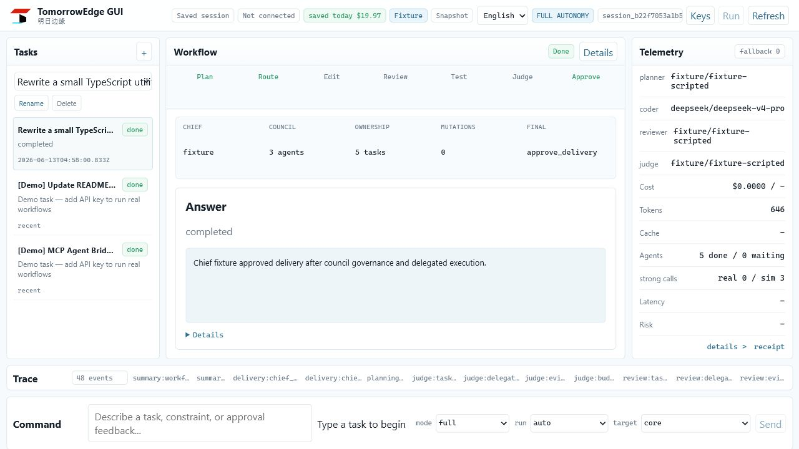
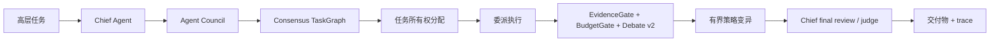
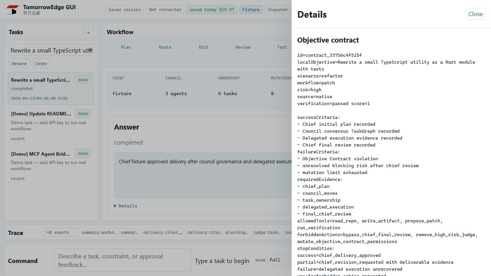
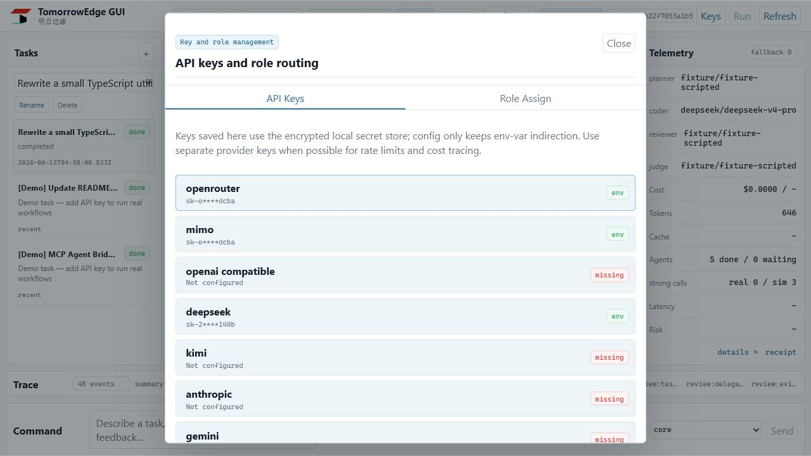
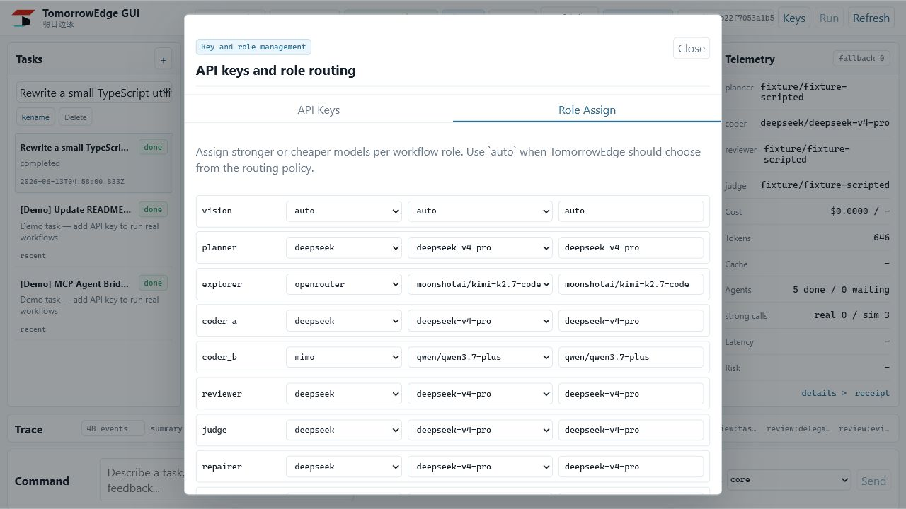

# TomorrowEdge / 明日边缘

[](https://github.com/axobase001/tomorrowedge/actions/workflows/ci.yml)

[English](README.md) | **中文**

TomorrowEdge / 明日边缘是一个**面向异构 Coding Agent 的本地编排治理与策略演化运行时**。

它提供一个 GUI/runtime 编排层，用来治理强 Agent、在预算约束下组织多模型执行、召集 Agent Council、分派 TaskGraph、记录证据、审查交付，并从 objective-action-feedback trace 中离线演化编排策略。

它不是聊天机器人，不是某个模型的一层 CLI 壳，不是 benchmark dashboard，也不是泛个人 Agent OS。TomorrowEdge 把 Codex、Claude Code、DeepSeek、MiMo、Ollama、OpenRouter 模型、本地模型、命令行 Agent、MCP Agent 和自定义 adapter 变成可替换的能力节点，放进一个可治理的软件工程 Council。

```text
Governed orchestration. Full traceability.
强 Agent 负责决策，高性价比 Agent 负责执行。
Codex / Claude Code 给 Agent full access。
TomorrowEdge 给异构 full-access Agent 治理、trace、预算和策略演化。
```



## 为什么存在

AI coding 的核心问题已经不只是“模型不够强”。强模型已经能写很多代码。

真正困难的是编排和治理：

- 哪个 Agent 应该负责架构规划？
- 什么时候值得消耗昂贵强 Agent 调用？
- 哪些实现劳动可以交给便宜模型或本地模型？
- 谁负责 review、judge 和解决分歧？
- patch / shell 执行前需要什么证据？
- 子任务失败后应该如何重分配、重规划或修复？
- full-access Agent 如何保持可见、可审计、可回滚、受预算约束？

OpenRouter 路由请求。TomorrowEdge 路由目标、能力、角色、工具、预算、证据、任务所有权、策略变异和工程交付。

## TomorrowEdge 1.6 Canopus

TomorrowEdge 1.6 **Canopus** 是 **The Convergence Runtime Release**，也就是目标收敛运行时版本。

Canopus 在现有编排治理运行时之上，引入目标收敛层。它不替代 TomorrowEdge “异构 Coding Agent 本地编排治理与策略演化运行时”的主定位，而是在其内部增加一条可验证目标收敛路径：Agent 不能因为“自称完成”就结束任务；一次运行必须满足 ObjectiveContract，通过 AcceptanceMatrix，留下 Evidence，更新 RunState，并服从有界 ConvergencePolicy。

当前状态：Canopus 已提供可运行的 convergence runtime，支持 mock、noop、shell 和 Sirius Council AgentBridge 路径。AgentBridge 可以提出或执行动作，但是否收敛只由结构化目标条件和阻断验收检查决定。

- ObjectiveContract / CanopusObjective：结构化目标定义，不能退化为 prompt。
- AcceptanceMatrix：定义 blocking_check 和 advisory_check。
- blocking_check 拥有否决权，review_agent 不能覆盖真实测试失败。
- RunState 每轮落盘，写入 `.runs/<run_id>/trace.jsonl`、`status.latest.json`、`progress.md` 和 evidence artifacts。
- ConvergenceEngine 执行 `observe -> pre-acceptance -> act -> observe -> post-acceptance -> write RunState -> decide next loop`。
- AgentBridge 包含 mock、noop、shell 和 Sirius Council 执行路径。
- `tedge control` 继续作为 1.6 的兼容 CLI alias 保留，并会在 stderr 输出兼容提示。

新旧命名 mapping：

| 早期 control-plane 命名 | Canopus 公开命名 |
| --- | --- |
| Agent Control Plane | Canopus convergence layer / Canopus Runtime |
| GoalSpec | ObjectiveContract / CanopusObjective |
| EvalSpec | AcceptanceMatrix |
| LoopSpec | ConvergencePolicy |
| StatusSpec | RunState / TraceState |
| ReconciliationController | ConvergenceEngine |
| EvaluationRunner | AcceptanceRunner |
| StatusStore | TraceStateStore / RunLedger |
| DesiredStateDiff | ObjectiveDelta |
| hard_gate | blocking_check |
| soft_gate | advisory_check |
| checker_agent | reviewer_role / review_agent |
| actuator | AgentBridge / worker_adapter |

快速开始：

```bash
tedge canopus init --title "Fix bug" --mode coding
tedge canopus validate goal.yaml
tedge canopus run goal.yaml
tedge canopus status
tedge canopus report
```

`tedge control ...` 继续作为同一组命令的兼容 alias 保留。旧版 `goal/evaluation/loop` schema 在 v1.6 中继续兼容；新的 Canopus 示例使用 `objective/acceptance/convergence`。

源码 checkout 离线 demo：

```bash
npm run dev -- canopus validate examples/canopus/simple_bugfix_runtime/objective.yaml
npm run dev -- canopus run examples/canopus/simple_bugfix_runtime/objective.yaml \
  --cwd examples/canopus/simple_bugfix_runtime \
  --adapter shell \
  --action-command "node fix-bug.mjs" \
  --run-id simple_bugfix_runtime
npm run dev -- canopus status --cwd examples/canopus/simple_bugfix_runtime --run-id simple_bugfix_runtime
npm run dev -- canopus report --cwd examples/canopus/simple_bugfix_runtime --run-id simple_bugfix_runtime
```

完整设计见 [Canopus Runtime](docs/canopus_runtime.md)。

## Sirius 1.5

**Sirius** 是 TomorrowEdge 1.5 版本线。它的主线运行时是 **Agent Council Governance Runtime**。

用户给出一个高层软件工程任务后，任务先进入 Chief Agent。Chief Agent 可以召集 Council Members 进行 critique、gap fill、alternative plan 和 task claim。Council 形成 consensus TaskGraph。每个核心 TaskNode 会得到 owner agent、provider、model 和 assignment reason。随后 TomorrowEdge 委派执行，同时由 EvidenceGate、BudgetGate、Debate v2、Objective Contract、Strategy Memory 和事件账本治理整个流程。最终交付会回到 Chief Agent 做 final review / judge。



Sirius 核心模块：

- **Chief Agent Router**：高层工程目标先进入 Chief Agent。
- **AgentCapabilityProfile**：按能力、角色、信任、成本、延迟和 adapter 支持替换模型或外部 Agent。
- **Agent Council Planning**：记录 critique、gap fill、alternative planning、task claim 和 consensus move。
- **Task Ownership Assignment**：每个核心 TaskGraph node 都有 `ownerAgentId`、`assignedProvider`、`assignedModel` 和 `assignmentReason`。
- **Delegated Execution Runtime**：委派执行节点，同时保留 Objective Contract、TaskGraph、RoleGraph、EvidenceGate、BudgetGate、Debate v2、Strategy Memory 和 Trace Ledger。
- **Bounded Strategy Mutation**：失败时可以 split task、switch owner agent、add reviewer/judge、increase debate 或 council replan，但不能改变安全边界。
- **Chief Final Review / Judge**：交付前必须回到 Chief Agent 做最终审查。

Sirius 仍是 experimental，但已经是项目主线。

## 最新运行截图

下面是从本地 `tedge client` GUI 对 Sirius council fixture session 实际截取的运行时截图，不是静态设计稿。

### Council Cockpit


### Objective Contract 与 Trace Drawer



### API Key 与 Provider 配置



### Role Assignment



## 差异化

| 类别 | 常见做法 | TomorrowEdge |
| --- | --- | --- |
| 单 Agent coding CLI | 一个强模型包办整个任务 | 多个 Agent 按角色、能力、成本、信任和证据被治理 |
| Model router | 给一次请求选择一个模型 | 路由目标、角色、工具、上下文、所有权、验证和交付 |
| Agent framework | 构建 agent graph | 作为 native workflow 和外部框架之上的 cockpit / governance layer |
| Benchmark dashboard | 优化榜单输出 | benchmark / dashboard 只是辅助评估工具 |
| Prompt optimization | 调 prompt 或固定 workflow | 从 objective-action-feedback trace 中演化编排策略 |
| Full-access 工具 | 给 Agent 很大权限 | 让 full-access 执行可见、可记录、可预算、可审查、可回滚 |

## 快速开始

```bash
npm install
npm run build
npm run client
```

GUI client 会打开本地 cockpit，用于自然语言任务、权限模式、provider 配置、角色路由、approval、telemetry、drawer details 和 trace inspection。

安装后的命令：

```bash
tedge client
tedge desktop
```

无 API key 体验：

```bash
npm run dev -- run "fix failing test" --headless --fixture-mode --approve-patch --approve-shell
```

运行 Sirius council：

```bash
npm run dev -- council run "Rewrite a small TypeScript utility as a Rust module with tests" --headless --fixture-mode
npm run dev -- council run \
  --headless \
  --fixture-mode \
  --config examples/configs/sirius-codex-deepseek-mimo.mock.yaml \
  --cwd examples/agent-council-rust-rewrite \
  "rebuild this JS CLI app in Rust"
```

Headless Sirius runs print `configSource` and `configPath`. The packaged mock
config can run from outside the repo root and records `chief_agent` / `agent`
sources when the mock command agents are invoked.

Installed-package equivalent:

```bash
tedge council run \
  --headless \
  --fixture-mode \
  --config node_modules/@axobase001/tomorrowedge/examples/configs/sirius-codex-deepseek-mimo.mock.yaml \
  --cwd node_modules/@axobase001/tomorrowedge/examples/agent-council-rust-rewrite \
  "rebuild this JS CLI app in Rust"
```

也可以通过普通 run 入口进入 council：

```bash
tedge run "rewrite this service with a safer architecture" --agent-council
```

## 配置 Provider

打开 GUI 后点击 **Keys** 配置 provider 和 role routing。TomorrowEdge 使用本地加密 secret store 或环境变量间接引用保存 key；配置文件只保存 env-var 引用，不保存明文 key。

推荐首次配置：

1. 不确定怎么选时，先用 OpenRouter。一个 key 可以接入多个模型家族。
2. 尽量给不同 provider 使用独立 key，便于限流隔离、成本追踪和故障定位。
3. 把更强的 Agent 分配给 chief / planner / reviewer / judge。
4. 把便宜或本地 Agent 分配给 explorer / coder / test / documentation 等低风险执行角色。
5. 如果希望 TomorrowEdge 自动按策略选择，就保留 `auto`。

Provider 运行时控制和工作流限制是分开的：

- `providers.<id>.requestTimeoutMs` 控制单次 HTTP / 模型请求超时。
- `providers.<id>.maxRetries` 控制 provider 级请求重试次数。
- `autonomy.max_iterations`、repair 和 debate 限制控制工作流轮数，不控制 HTTP 请求超时。

示例角色意图：

```yaml
chief_agent:
  prefer: [strong_reasoning, external_codex, external_claude]

role_routing:
  planner:
    prefer: [strong_reasoning]
  coder_a:
    prefer: [coding, fast]
  coder_b:
    prefer: [cheap, coding]
  reviewer:
    prefer: [strong_reasoning, conservative]
  judge:
    prefer: [strong_reasoning]
```

截图里的模型名只是示例，不是产品硬编码要求。

## 核心概念

### Objective Contract

TomorrowEdge 在 planning 前插入可验证的目标契约。契约定义 success criteria、failure criteria、allowed tools、forbidden actions、required evidence、budget bounds、role permissions 和 stop conditions。Planner 可以补充执行细节，但不能放松契约。

### Agent Council

Chief Agent 可以召集多个可替换 Agent 组成 Council。Council move 包括：

- critique
- gap fill
- alternative plan
- task claim
- consensus revision
- final consensus

### Task Ownership

TaskGraph node 不只是抽象 label。核心节点会带上具体所有权：

- `ownerAgentId`
- `assignedProvider`
- `assignedModel`
- `assignmentReason`
- fallback candidates
- evidence refs
- artifact refs

### Evidence 与 Trace

运行时完整 artifact 会保留用于 replay，同时只把压缩后的 evidence packet 投影给模型。每个关键动作都会进入事件账本：routing decision、budget decision、model call、council move、task result、review、judge、patch、shell、repair、mutation 和 final summary。

### Orchestration Policy Genome

受进化算法启发，TomorrowEdge 把编排策略作为演化单位。

系统不演化模型权重、原始 prompt 或单个答案，而是演化有界 runtime policy：如何生成契约、如何规划、如何路由角色、如何验证证据、如何修复失败、如何检索 trace、什么时候停止或询问用户。

> 进化单位不是答案、prompt 或 Agent，而是 orchestration policy。

安全边界不可被变异。

## 权限模式

| 模式 | 行为 |
| --- | --- |
| `restricted` | 不执行 patch 或 shell，只读和 advisory workflow。 |
| `partial` | patch 和 shell 需要审批。 |
| `full` | 在 policy 允许时自动执行 patch、shell 和 repair，但每一步仍然写入 ledger。 |

Full access 的含义是 governed autonomy + full traceability，不是静默执行。

## 常用命令

```bash
tedge client                         # 本地 GUI client
tedge desktop                        # 可选桌面窗口
tedge run "fix failing test"          # native workflow
tedge run "..." --agent-council       # Sirius council path
tedge council run "..."               # 显式 council runtime
tedge models --connection-test        # provider 连接测试
tedge trace latest --verbose          # 查看最新事件账本
tedge sessions inspect latest         # 结构化 session inspector
tedge policy inspect                  # policy genome
tedge policy evolve --offline         # 离线策略演化
tedge skills list                     # governed skills and tool packs
tedge mcp serve                       # 外部 Agent MCP bridge
```

开发检查：

```bash
npm run build
npm run web:build
npm run docs:status
npm run secrets:scan
npm run test:council
```

## 外部 Agent

TomorrowEdge 不替代 Codex、Claude Code 或其他 coding agent。它可以通过 MCP 或 command adapter 把它们绑定到 workflow roles 里。

例子：

- Codex 作为 Chief Agent、planner、reviewer 或 judge。
- Claude Code 作为 architecture reviewer 或 final judge。
- DeepSeek / Kimi / Qwen / MiMo 作为 implementation、exploration 或 test-planning agent。
- Ollama 或本地 Agent 负责隐私敏感角色。

外部 Agent 应提交 typed role output，而不是只提交 opaque final answer。

## 能力拼接

TomorrowEdge 路由的是能力，不只是请求。

例子：

```text
Screenshot / diagram / error image
  -> Vision Agent
  -> Structured Visual Spec
  -> Planner / Coder
  -> Patch / Test
  -> Reviewer / Judge
```

能看图的模型不一定要写代码。写得快的模型不一定要负责最终判断风险。

## 文档

- [Agent Council Governance Runtime](docs/AGENT_COUNCIL_GOVERNANCE.md)
- [Agent Capability Profiles](docs/AGENT_CAPABILITY_PROFILES.md)
- [Chief Agent Runtime](docs/CHIEF_AGENT_RUNTIME.md)
- [Delegated Execution Runtime](docs/DELEGATED_EXECUTION_RUNTIME.md)
- [Policy Evolution Runtime](docs/POLICY_EVOLUTION_RUNTIME.md)
- [Objective Contracts](docs/OBJECTIVE_CONTRACTS.md)
- [Trace Memory](docs/TRACE_MEMORY.md)
- [Adaptive Orchestration Runtime](docs/ADAPTIVE_ORCHESTRATION.md)
- [MCP Agent Bridge](docs/MCP_AGENT_BRIDGE.md)
- [Local Cockpit API](docs/LOCAL_COCKPIT_API.md)
- [Capability Status](docs/CAPABILITY_STATUS.md)
- [README Promise Map](docs/README_PROMISE_MAP.md)

## 当前状态

当前版本：`1.6.2` Canopus。

主要已实现能力：

- GUI client 和可选桌面 shell。
- Provider onboarding 与连接测试。
- Role routing 与可配置角色分配。
- Objective Contract。
- Agent Council Governance Runtime。
- Task ownership assignment。
- Delegated execution events。
- Evidence packet 与 artifact-aware trace export。
- Budget governance 与 real/simulated strong-agent telemetry。
- Debate v2、reviewer、judge、repair、bounded mutation events。
- MCP bridge 与 command external-agent runner skeleton。
- Offline fixture workflows 与 deterministic council demo path。

仍处于实验状态的部分：

- 更深的 Codex / Claude Code 外部进程集成。
- 完全异步 graph runtime。
- 长周期 policy evolution 质量。
- 公开对比评估。

## 隐私与安全

TomorrowEdge local-first。Session、artifact、trace 和本地 secret 默认留在本地 workspace，除非你显式配置外部 provider 或发布 artifact。

不要提交真实 API key。使用环境变量或本地加密 secret store。如果 key 曾经出现在聊天、截图或公开日志里，建议轮换。

## License

MIT
