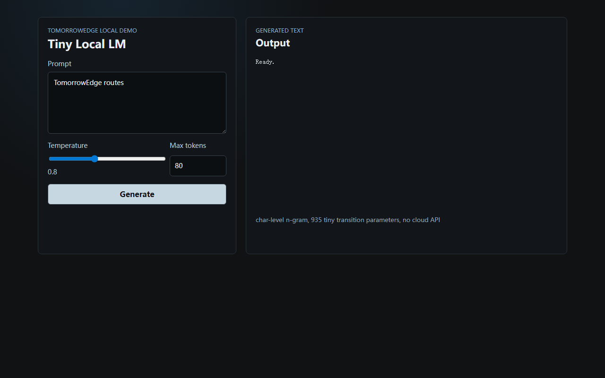
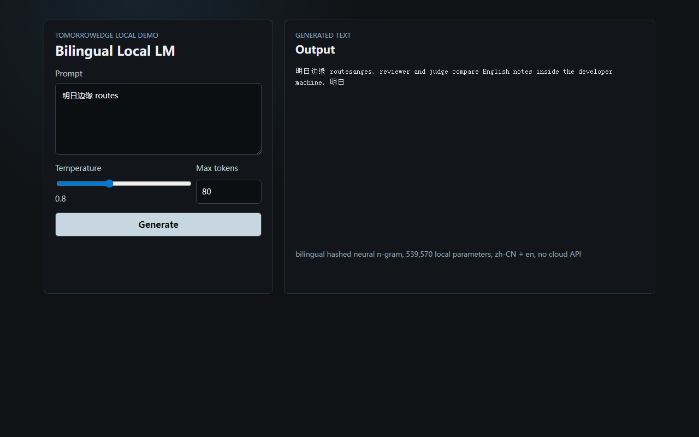

# Tiny Local LM Demo

A locally runnable 50M-60M parameter bilingual language model demo for TomorrowEdge acceptance.

## Setup

```bash
npm install
npm start
```

Open `http://127.0.0.1:8787`.

## API

- `GET /health`
- `GET /model-info`
- `POST /generate`

Example:

```bash
curl -s http://127.0.0.1:8787/generate \
  -H "Content-Type: application/json" \
  -d '{"prompt":"明日边缘 routes","temperature":0.8,"maxTokens":80}'
```

## Screenshots





## Tests

```bash
npm test
npm run api:smoke
npm run frontend:build
npm run verify
```

## Notes

The model is a local bilingual hashed neural n-gram model with roughly 50M-60M parameters by default. It combines dense context bucket embeddings, output embeddings, and 5-gram transition boosts over a generated Chinese/English corpus. It does not call OpenAI, OpenRouter, or any other cloud API.
